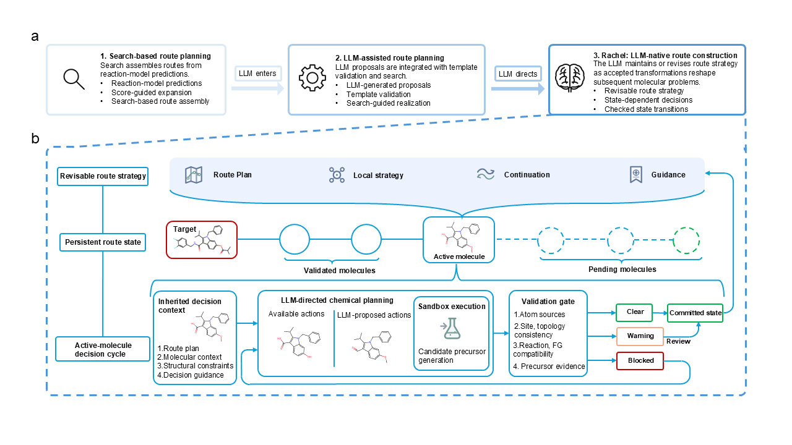
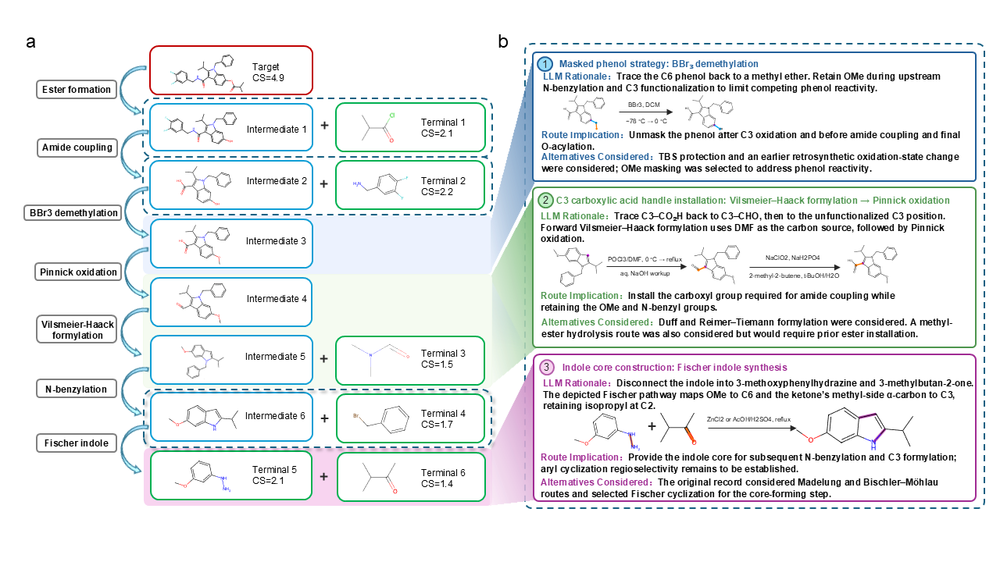

[English](README.md) | [简体中文](README.zh-CN.md)

# Rachel

**LLM-directed multistep retrosynthesis, from chemical decisions to complete routes.**

[How It Works](#how-it-works) · [Route Example](#route-example) · [Research](#research) · [Research Data](#route-atlas) · [Get Started](#get-started) · [Using Rachel](#working-with-routes) · [License](#license)

Every retrosynthetic choice changes the molecules that must be made next.
A plausible disconnection can leave precursors that are harder to prepare, demand
different selectivity, or call for a new synthesis strategy. Planning a complete
route therefore requires chemical judgment to continue as the problem changes.

**Rachel gives a general-purpose language model a persistent environment in which
to do that work.** The model proposes transformations, evaluates alternatives and
revises its route strategy. Rachel supplies molecular context, executes candidate
transformations in a computational sandbox, returns validation evidence and carries
accepted steps into the next decision. The developing route and the decisions
behind it remain available for inspection.

This repository brings together the **Rachel-beta runtime** and the **complete
PaRoutes120 and RF25 Route Atlas** used in our manuscript. You can explore the
recorded results without installing Rachel, or use the runtime with a tool-capable
LLM agent to construct and review routes.

<a id="how-it-works"></a>
## How It Works



*System overview from the manuscript. Accepted transformations change the route
state and the molecular problems presented to the next decision. The top panel
compares ways of organizing planning, rather than benchmark performance.*

The LLM holds the synthesis strategy; the environment makes its consequences
explicit. Each active molecule is considered alongside the current plan,
structural constraints and decisions already made.

1. **Propose the next transformation.** The model can examine predefined
   bond-disconnection and functional-group operations or propose its own
   precursor set and reaction.
2. **Examine the chemical evidence.** A sandbox generates candidate precursors
   and returns checks on atom sources, reaction sites, topology and compatibility.
   The model can compare candidates, address warnings or revise the proposal;
   hard blocks prevent commitment.
3. **Continue from the accepted state.** Committing a transformation updates the
   route tree. Precursors requiring synthesis become subsequent planning
   problems, and the overall strategy can be revised as the route develops.

The chemical tools inform decisions; the LLM or chemist remains responsible for
interpreting them. A passed check records what the validator could establish,
while missing evidence remains visible in the planning record.

<a id="route-example"></a>
## A Complete Route and Its Chemical Decisions

Figure 2 from the manuscript follows target `n1_366` through a seven-step route
to six terminal precursors. Alongside the complete route, three decision summaries
show how individual reaction choices support the synthesis strategy.



[View full-size image](docs/assets/rachel-route-decisions.png) ·
[Open PDF](docs/assets/rachel-route-decisions.pdf)

Read the left panel from the target down towards its precursors. Reaction names
refer to the forward transformations. The right panel explains three choices:

- **Manage phenol reactivity:** retain a methyl ether during upstream transformations,
  then unmask the phenol later in the synthesis.
- **Install the C3 carboxyl group:** use formylation followed by oxidation to provide
  the handle for subsequent amide coupling.
- **Construct the indole core:** use Fischer cyclization to establish the scaffold
  for subsequent functionalization.

Each summary connects the recorded rationale, its implication for the route and
the alternatives considered. The figure illustrates a planning proposal; the
[complete Atlas](#route-atlas) provides the broader collection of recorded routes.

<a id="research"></a>
## Research

Our study asks whether a general-purpose LLM can sustain chemical planning
across a route as earlier decisions reshape later problems. GPT-5.5 planned
within Rachel from target structures, without supplied reference routes or
route-level solutions.

| Dataset | Setting | Rachel strict closure |
| --- | --- | ---: |
| PaRoutes120 | 120 targets drawn from PaRoutes | 111 / 120 |
| RF25 | A separate cohort of 25 difficult targets from molecular-probe and chemical-biology studies | 24 / 25 |

**Strict closure** required complete route construction and independent source
resolution of every terminal precursor after planning. That source audit was
not available to the planner. These are computational planning outcomes;
experimental synthesis remains to be tested.

The study follows route construction beyond this endpoint:

- **Chemistry along the route.** On the 58 PaRoutes targets closed by all four
  methods in the matched quality comparison, forward-model assessments and
  method-blinded whole-route appraisals provided complementary evidence about
  the proposed chemistry. Both whole-route evaluators assigned Rachel the
  highest mean overall score, with Opus 5 rating it closely to direct LLM.
  Forward support remained partial, particularly on RF25.
- **Decisions as the route evolves.** Recorded trajectories show model-proposed
  chemistry entering routes from early to late positions, alongside revisions
  to synthesis plans and subsequent steps registered under those revisions.
- **The role of continued planning.** Replacing LLM decisions with fixed policies
  reduced PaRoutes strict closure to 6–15 of 120 targets, despite continued local
  chemical execution. Restrictions on planning support also reduced RF25
  closure. These comparisons examine the behaviour of the system as a whole.

The published route records retain the versions used in the study. Features
added to the runtime later should not be assumed to have been active in every run.

<a id="route-atlas"></a>
## Research Data

Explore the complete recorded routes by target and method, including the
PaRoutes reference routes.

| Route Atlas | Offline viewer |
| --- | --- |
| PaRoutes120 | [Open dataset](data/route-atlas/PaRoutes120.html) |
| RF25 | [Open dataset](data/route-atlas/RF25.html) |

Download and extract the repository, then open either HTML file in a browser.
No installation or API key is needed; GitHub does not run the interactive viewer.

**Source Data:** [Download ZIP](https://github.com/ChazenLi/Rachel/releases/download/manuscript-data-20260907/Rachel-Source-Data-20260907.zip).
Figure data and supporting documentation are included in the package.

[Version and license](data/README.md)

<a id="get-started"></a>
## Get Started

### Browse the results

Use the Route Atlas above. No model access or installation is required.

### Run Rachel

From a terminal with Git and Conda available:

```bash
git clone https://github.com/ChazenLi/Rachel.git
cd Rachel
conda env create -f environment.yml
conda activate rachel-v2
```

The supplied environment specifies Python 3.11, RDKit and the supporting
libraries. The public runtime was prepared on Windows; other platforms have
not been verified by this distribution.

Give your tool-capable LLM agent access to this checkout and the
[Rachel skill and command protocol](Rachel/skill.md). Model access belongs to
the host agent. The runtime exposes the chemistry and session tools through a
Python command interface.

### Start your first planning task

1. **Open the repository in your agent's workspace.** The agent needs permission
   to run local Python commands using the activated `rachel-v2` environment.
   Ask it to read `Rachel/skill.md` before starting.
2. **Provide the target structure and your priorities.** Use a SMILES string,
   including stereochemistry where specified. Add relevant preferences, such as
   an available starting material, a reaction to avoid or a branch to reconsider.
   The agent should explain how those preferences affect its chemical choices.
3. **Ask for a saved route and report.** Keep each target in its own run directory.
   Request the session path, route overview, reaction steps and starting-material
   list so you can inspect the work and return to it later.

For example, send your agent this request after replacing the target placeholder:

```text
Read Rachel/skill.md and use Rachel in the rachel-v2 environment to plan a
retrosynthetic route for this target: <target SMILES>.
Create a new run directory, preserve the specified stereochemistry and explain
the main chemical choices. Save the session as you work. At the end, export the
route overview, reaction report and starting-material list, and give me their
paths. Identify any remaining unresolved precursors or evidence gaps.
```

You can give feedback during planning, for example, "Reconsider the proposed
coupling using this starting material." The agent translates your request into
Rachel's planning tools; you do not need to enter each tool command yourself.
New planning uses your host agent's model access; browsing the published Atlas does not.

<details>
<summary><strong>Optional: use the Python command interface directly</strong></summary>

The following starts a fresh session and inspects its initial planning context:

```python
from pathlib import Path
from tempfile import mkdtemp

from Rachel.tools.logged_runner import LoggedRetroCmd

run_dir = Path(mkdtemp(prefix="rachel_"))
cmd = LoggedRetroCmd(str(run_dir / "session.json"))

cmd.execute("init", {
    "target": "CC(=O)Nc1ccc(O)cc1",
    "name": "paracetamol",
})
print(cmd.execute("next", {}))
print(cmd.execute("context", {"detail": "compact"}))
print(f"Session and command logs: {run_dir}")
```

A complete run continues through chemical proposals, sandbox checks, explicit
selection and route updates until finalization. The
[command protocol](Rachel/skill.md) documents this loop and the evidence needed
at each decision. `LoggedRetroCmd` records command inputs and outputs alongside
the persistent session.

</details>

<a id="working-with-routes"></a>
## Using Rachel Day to Day

Use ordinary task descriptions with your agent. Include the saved session path
when returning to an existing route, and identify the molecule or step you want
to discuss.

| What you want to do | What to ask your agent |
| --- | --- |
| Build a new route | "Plan a route for this SMILES, taking these starting materials and chemical preferences into account." |
| Resume saved work | "Resume this session from its saved state and continue the unfinished branches." |
| Understand a decision | "Show the route so far and explain the precursors, alternatives and validation findings for this step." |
| Decompose an advanced terminal | "Continue decomposing this terminal into simpler precursors within the same route." |
| Compare a different strategy | "Create an independent alternative from this node in the finalized route, keeping the original route intact." |
| Review terminal sources | "Audit the terminal-source evidence for this finalized route and show which entries remain unresolved." |
| Share or analyse results | "Export the HTML report, route diagram, reaction steps, terminal list and JSON records to this folder." |

**Keep the run directory.** Save `session.json` and its neighbouring command logs.
To resume, point the agent to that session rather than asking it to initialize the
same target again. Reopening a terminal changes the existing route; requesting
an independent alternative preserves the finalized original.

**Read the exported report.** The HTML report provides a route overview and step
details. Keep its `images/` folder alongside it when sharing or moving the report.
`tree.json` and `terminals.json` provide structured route and terminal records.
Check any unresolved branches and the reported evidence before using a proposal
to guide laboratory work. Online terminal-source lookup requires network access;
an offline audit retains unresolved external evidence.

**Extend chemical context.** The runtime supports versioned base, team and project
knowledge packs for prompts, experience and chemical resources. Each session pins
its selected profile. Packs add information while retaining the runtime's
validation and state constraints. Recorded experimental outcomes can inform
inactive knowledge drafts; expert review and explicit publication are required
before a new pack version is used in a later session.

| Repository entry | Contents |
| --- | --- |
| [Rachel/skill.md](Rachel/skill.md) | Agent instructions, public commands and planning protocol |
| [Rachel/main](Rachel/main) | Session orchestration, route state, reports and command interface |
| [Rachel/chem_tools](Rachel/chem_tools) | Molecular analysis, candidate operations and validation |
| [Rachel/knowledge](Rachel/knowledge) | Knowledge resources, versioned profiles and pack CLI |
| [Rachel/tools](Rachel/tools) | Command logging, terminal auditing and visualization utilities |
| [data/route-atlas](data/route-atlas/README.md) | Complete manuscript route comparisons and their evidence records |

## Outlook

Retrosynthesis offers a concrete setting in which to study how a language model
carries chemical decisions forward. A broader direction is to connect molecular
design, synthesis planning and experimental evidence: difficulty preparing a
candidate could inform its redesign, and an unexpected result could change the
next hypothesis or experiment. Rachel makes part of that interaction inspectable
in computational route planning. Extending it to reliable experimental research
is a future objective.

<a id="license"></a>
## License and Data Attribution

Rachel-authored material is distributed under **CC BY-NC 4.0**.
Non-commercial sharing and adaptation require attribution; commercial use is
outside this license. See [LICENSE](LICENSE).

PaRoutes reference data originate from
[PaRoutes, Zenodo record 7341155](https://doi.org/10.5281/zenodo.7341155).
Third-party materials retain their upstream terms. Bundled viewer-library notices
are provided in [THIRD_PARTY_NOTICES.txt](data/route-atlas/THIRD_PARTY_NOTICES.txt).
For reuse of the route results, retain the dataset and source identifiers and
record the repository commit used.
