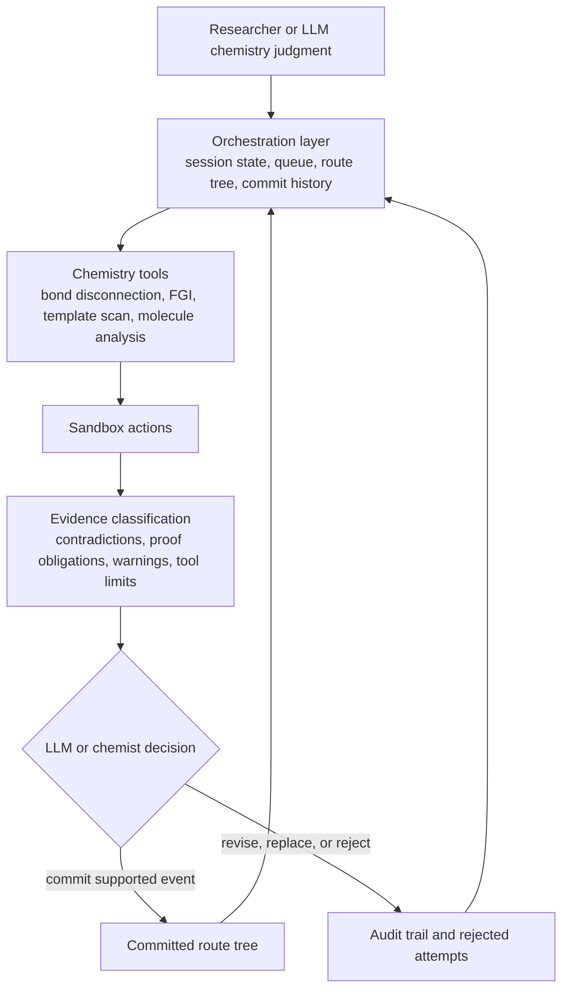
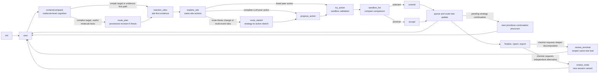
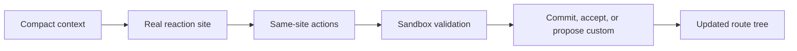
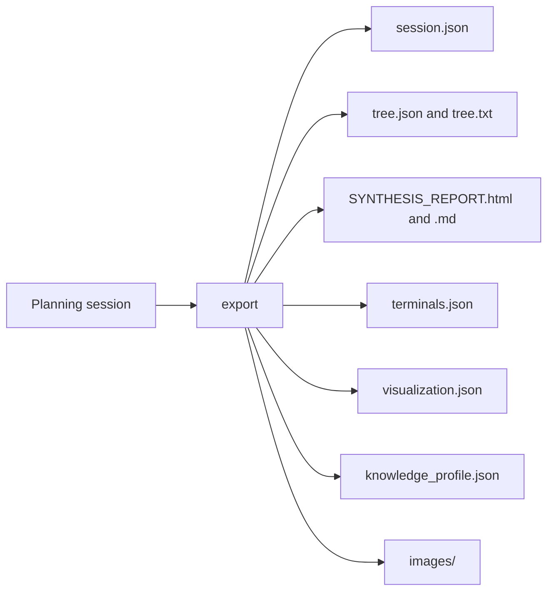

<div align="right">

[English](./README.md) | [简体中文](./README.zh-CN.md)

</div>

<div align="center">

<a id="top"></a>

# Rachel

**Information-grounded, LLM-directed multi-step retrosynthesis**

This repository contains the `Rachel-beta` runtime and the manuscript's complete
PaRoutes120 and RF25 route results. It is distributed under **CC BY-NC 4.0**; commercial use
is not permitted under that license. See [`LICENSE`](./LICENSE).


<p>
  <a href="#trace-demo">Trace Demo</a> |
  <a href="#why-rachel">Why Rachel</a> |
  <a href="#system-view">System View</a> |
  <a href="#pluggable-knowledge">Knowledge Packs</a> |
  <a href="#complete-route-results">Complete Route Results</a> |
  <a href="#minimal-quickstart">Quickstart</a>
</p>

https://github.com/user-attachments/assets/4dc9990f-00b2-40d8-a8c3-181c6f0c568b

</div>

Multi-step retrosynthesis is not only about proposing a locally plausible disconnection. It also requires preserving scaffold consistency, functional-group compatibility, route convergence, and precursor executability across multiple dependent steps. Rachel is built around that stricter formulation.

Rachel follows three core principles: it supplies chemical information rather
than replacing chemical judgment; chemical truth and route quality always come
first; and route design should be bold and inventive while every committed step
is validated and audited strictly. Templates, Smart CAP, reaction-family names,
scores, and gates are structured aids. The LLM or chemist remains responsible
for designing the chemistry and deciding what the evidence supports.

Rather than treating retrosynthesis as a one-shot text generation problem, Rachel formalizes route construction as a persistent `state -> action -> validation -> commit` process. Action steps are explored in a sandbox, checked by chemistry-grounded validators, and only then written into the main route tree. The result is a planning workflow that is easier to inspect, recover, compare, and analyze at route level.

At a glance, Rachel combines:

- persistent session state instead of isolated route guesses
- chemistry-grounded reference operators such as bond disconnection and FGI
- sandboxed local trials before route-tree commitment
- validation gates including forward checks, atom balance, and site-aware auditing
- explicit route memory, audit traces, and exportable planning artifacts
- LLM-directed route and reaction design over structured chemical evidence

<a id="pluggable-knowledge"></a>
## Pluggable Knowledge Packs And Controlled Learning

Rachel resolves one immutable knowledge profile for each session:
`rachel.base@1.0.0 -> team pack -> project pack`. The selected pack IDs,
versions, manifest hashes, profile hash, and matched entry IDs remain auditable;
active sessions do not hot-reload. Missing packs or changed hashes fail loudly
on reload, export, and route variants.

The profile currently covers 18 data-only resource interfaces across runtime
prompt policy, experience cards, reactions, functional groups, reactive sites,
SMARTS, Smart CAP, family interpretation, EAS nitration heuristics, and
risk/compatibility catalogs. External packs cannot execute Python or weaken
locked state-machine, atom-accounting, topology, contradiction, or validation
gates.

`committed` means only that a planning event entered the route tree; it never
means experimental success. Use `record_outcome` for real experimental facts,
then `learning_review` and `propose_knowledge` after explicit finalization.
Proposals remain `active=false` staging drafts. Expert approval is required but
does not activate them: only the standalone pack CLI can publish a new immutable
version for a later session.

```python
cmd.execute("init", {
    "target": "CC(=O)Nc1ccc(O)cc1",
    "knowledge_profile": ["team.acme@1.2.0", "project.alpha@3.0.0"],
    "knowledge_roots": ["knowledge_packs"],
})
```

The published [knowledge package](Rachel/knowledge) contains the resource files,
profile implementation and [pack CLI](Rachel/knowledge/cli.py).

<a id="trace-demo"></a>
## Trace Demo

The trace above is the fastest visual entry point into Rachel. It shows how the system moves from structured context to sandboxed actions, validation evidence, LLM/chemist selection, and committed route growth.


- The emphasis is on planning behavior, not only final route output
- Rejected attempts remain part of the story instead of disappearing into free-form text
- The figure is useful for understanding what Rachel is doing between target input and final route export

<a id="complete-route-results"></a>
## Complete Route Results

The manuscript's complete PaRoutes120 and RF25 route comparisons are available
in [data/route-atlas](data/route-atlas/README.md), including Rachel's GPT-5.5
results, comparator methods and the PaRoutes reference routes.

| Dataset | Coverage | Offline route viewer | Structured records |
| --- | --- | --- | --- |
| PaRoutes120 | All 120 targets, 8 methods and 120 Reference routes | [PaRoutes120.html](data/route-atlas/PaRoutes120.html) | [PaRoutes120.json](data/route-atlas/data/PaRoutes120.json) |
| RF25 | All 25 targets, 4 methods | [RF25.html](data/route-atlas/RF25.html) | [RF25.json](data/route-atlas/data/RF25.json) |

Download the repository using **Code > Download ZIP**, or clone it. Open either
HTML file locally in a browser; GitHub's file page does not run the viewer.
No server, API key or Python installation is needed to browse the routes.

Select a target and compare methods side by side. Each viewer includes molecular
structures, reaction steps, recorded route outcomes and matched evaluation or
terminal-source evidence where available. Incomplete and unavailable outcomes
remain visible. PaRoutes120 opens with Rachel and Reference; RF25 opens with
Rachel and Direct LLM.

The [route index](data/route-atlas/ROUTE_INDEX.csv) covers all 1,180 comparison
positions: 1,060 method outputs and 120 separate Reference entries. The
[data dictionary](data/route-atlas/DATA_DICTIONARY.md) describes the JSON fields;
the [data notes](data/route-atlas/README.md) document route versions and sources.
These are the manuscript's adopted computational results, not newly generated
runs. Strict closure denotes completed planning with independently source-resolved
terminals; it does not denote laboratory synthesis.

<a id="why-rachel"></a>
## Why Rachel

Many retrosynthesis systems can output route-like text. Rachel is organized around a different question: how should a route be **constructed** when intermediate decisions must remain visible, reviewable, and recoverable?

That framing creates a strict role boundary:

- the LLM or chemist owns route hypotheses, reaction design, precursor
  completion, evidence reconciliation, and terminal decisions
- the chemistry layer supplies molecular facts, candidate-space scaffolds,
  atom/source/topology observations, and validation findings
- the orchestration layer preserves state, route-tree structure, and decision history
- validation gates classify contradiction, proof obligation, warning, and tool
  limitation; they do not choose the reaction

Rachel therefore shifts the task from "generate a route" to "make bold chemical
hypotheses inside a traceable process that forces strict validation before the
route changes."

## Highlights

| Capability | What it means in Rachel |
| --- | --- |
| Stateful planning | Rachel reasons over persistent session state instead of isolated one-shot answers. |
| Reference action space | Bond disconnection, FGI, templates, and Smart CAP suggest possible chemistry without defining the retrosynthesis boundary. |
| Sandbox before commitment | Action steps are tried locally before they affect the main route tree. |
| Evidence-classifying gates | Forward checks, atom balance, topology, and site audits separate contradictions, proof obligations, warnings, and tool limits. |
| Site-aware auditing | Local position consistency checks help catch deceptively plausible but misaligned precursors. |
| Topology and atom-source proof | High-risk ring/scaffold edits carry atom-mapped evidence, family interpretation, and override-aware audit prompts. |
| Structured route memory | Accepted steps become explicit route-tree objects rather than only free-form text. |
| Audit-aware planning | Failed attempts and local checks remain available as planning evidence instead of being discarded. |
| LLM as chemistry decision layer | The LLM can propose unlisted chemistry and owns the final route judgment, while every commit remains auditable. |
| Pinned knowledge profiles | Built-in, team, and project JSON packs compose once per session with version, hash, and entry-level provenance. |
| Controlled experience learning | Experimental outcomes and inactive knowledge drafts remain separate from route commits until expert review and immutable publication. |

## Current Planning Contract

- Listed Rachel actions and complete LLM-designed one-step actions are peer
  hypotheses. A custom action leads with its positive chemical case; comparison
  and rejected IDs are secondary provenance used only when relevant.
- A complex target can begin with a short provisional route thesis and then use
  Rachel site/action evidence to support, falsify, enrich, or revise it. When
  molecule-level facts are insufficient, site evidence can come first.
- Discovery emphasizes route design, convergence, scaffold/handle strategy,
  and candidate generation. Audit exposes state-specific validation guidance
  only when the corresponding evidence exists.
- Experience cards are relevance-filtered reminders, not chemical verdicts or
  a quota to fill. Sparse contexts can remain sparse.
- `review_terminal` reopens the same terminal leaf in the original route tree.
  The added route follows the normal planning loop and must later be closed by
  an explicit `finalize`.
- `review_node` creates and activates an independent session variant from a
  finalized route. It can extend a terminal or replace the selected target or
  intermediate expansion without changing the parent session.
- Runtime prompt, experience, reaction, SMARTS, CAP, family, and risk assets
  come from the session's pinned knowledge profile. External packs cannot run
  Python or weaken locked contradiction and validation gates.
- `committed` means that a planning action entered the route tree; it is never
  an experimental-success label. Use `record_outcome`, `learning_review`, and
  `propose_knowledge` for controlled feedback and inactive staging drafts.

<a id="system-view"></a>
## System View

Rachel follows a layered design: orchestration manages the planning session,
chemistry tools generate facts, hints, and validation evidence, and the LLM or
chemist designs and selects chemistry over compressed structured context.



This separation matters. Deterministic tools establish inspectable facts; the
model is free to challenge weak templates and invent better chemistry, but it
cannot write an unaudited event into the route tree.

## Orchestration View

The repository is not only a collection of reaction operators. It also exposes an explicit planning protocol that makes state transitions inspectable.



This is the main reason Rachel reads more like a planning system than a one-shot
generator. A provisional `route_plan` can be challenged and completed with
site evidence; listed and LLM-designed actions share the same sandbox path;
`route_sketch` is reserved for route-level translation, multi-event ideas, and
terminal review rather than acting as permission for custom chemistry. When a
mini-route needs multiple real events, persistent continuation keeps the next
precursor visible. Reopened terminals return to this same loop instead of a
separate repair path.

## Validation Stack

The paper-intro framing becomes more concrete if the validators are made explicit:

| Validation layer | Purpose |
| --- | --- |
| Forward executability | Checks whether a proposed step remains plausible under forward-style evaluation. |
| Atom and scaffold consistency | Prevents bookkeeping errors and route drift that look plausible in text but fail structurally. |
| Functional-group compatibility | Flags local chemistry conflicts before commitment. |
| Site-aware auditing | Helps detect same-scaffold precursors that modify the wrong position. |
| Route-state constraints | Ensures accepted steps remain consistent with the live session and route-tree state. |

Validation results are exposed as commit-facing gates rather than only a single
score:

- `blocked`: do not commit; distinguish a chemistry contradiction from a validator/system error
- `proof_required`: add atom-source, site, tether, anchor, or mechanism evidence before any override
- `inconclusive`: separate chemistry evidence gaps from template/tool coverage limits
- `warning`: address the warning explicitly before commit
- `clear`: no gate objection; normal chemistry review still applies

Public `RetroCmd` validation payloads use `rachel.validation.v2`. Legacy
`forward_validation`, `validation_micro`, and `evidence_packet` structures remain
readable in historical session files but are not the normal LLM-facing protocol.

Reaction family names and forward-template coverage are proof-obligation hints,
not hard gates by themselves. A family mismatch, unknown custom reaction name, or
`template_not_attempted` should require stronger atom-source/site-fidelity
evidence; only concrete chemical contradictions such as atom/skeleton imbalance,
forbidden functionality, or a true topology hard fail should block directly.
Reactive organometallic reagents remain in the current reaction precursor set;
preflight records their organic-halide and metal sources as a separate upstream
obligation before verdicts are made.

## Core Workflow



This is the compact view of the Rachel loop. The key difference from route-text generation is that validated actions become durable route objects, while rejected actions remain informative planning artifacts.

<a id="minimal-quickstart"></a>
## Minimal Quickstart

Current local runs assume a Python environment with the main research dependencies already available, including Python 3.10+, RDKit, `numpy`, and `Pillow`.

```python
from Rachel.main import RetroCmd

cmd = RetroCmd("my_session.json")

cmd.execute(
    "init",
    {
        "target": "CC(=O)Nc1ccc(O)cc1",
        "name": "Paracetamol",
        "terminal_cs_threshold": 1.5,
    },
)

ctx = cmd.execute("next", {})
sites = cmd.execute("reaction_sites", {})

site_id = sites["site_reaction_map"][0]["site_id"]
detail = cmd.execute("explore_site", {"site_id": site_id})

# Listed and complete LLM-designed actions are peer hypotheses. This flag only
# demonstrates both API branches; normal use chooses on chemistry and route fit.
use_llm_peer = False
if use_llm_peer:
    peer = cmd.execute(
        "propose_action",
        {
            "precursors": ["CC(=O)Cl", "Nc1ccc(O)cc1"],
            "reagents": ["CCN(CC)CC"],
            "reaction_name": "Schotten-Baumann acylation",
            "action_label": "peer acetylation precursor set",
            "why_existing_actions_rejected": "",
            "rationale_summary": "Acetyl chloride supplies the acetyl carbonyl, p-aminophenol supplies the amide nitrogen and aryl-phenol skeleton, and base captures HCl; this is one chemoselective amide-forming event at the aniline nitrogen.",
            "risk_tags": ["custom_precursor", "atom_accounting", "chemoselectivity"],
        },
    )
    action_id = peer["action_id"]
else:
    action_id = detail["actions"][0]["action_id"]

attempt = cmd.execute("try_action", {"action_id": action_id})
sandbox = cmd.execute("sandbox_list", {})
validation = attempt["validation"]

committed = cmd.execute(
    "commit",
    {
        "idx": attempt["attempt_idx"],
        "expected_action_id": action_id,
        "reasoning": "Explicit site, precursor, atom-accounting, validation, and rejected-action audit.",
        "confidence": "medium",
        "rejected": [],
    },
)
assert committed.get("step_id")
```

When a chemist asks to continue decomposing a terminal from a closed or
historical route, reopen the original tree leaf rather than starting a detached
analysis:

```python
cmd.execute("review_terminal", {
    "smiles": terminal_smiles,
    "reason": "chemist requests deeper decomposition",
    "additional_steps": 10,
})
```

The node returns to the normal `next`/site/action/validation/commit loop. After
the extended tree closes, call `finalize` again explicitly.

For an independent alternative from any node in a finalized route, create a new
session variant. `node_id` is preferred; `smiles` is compatible, and both must
resolve to the same node when provided together:

```python
cmd.execute("review_node", {
    "node_id": review_node_id,
    "reason": "replace this branch with a chemist-directed route",
    "instruction": "use the specified reaction and avoid the hazardous reagent class",
    "constraints": ["preserve the scaffold"],
    "variant_session_file": "runs/route_variant.json",
    "additional_steps": 10,
})
```

The finalized parent file remains unchanged and `RetroCmd` switches to the new
variant. A terminal is extended; a target or expanded intermediate has its old
downstream expansion removed only in the variant. Shared convergence nodes and
the retained prefix keep their IDs. Raw guidance is stored in the variant JSON,
while the default prompt receives a compact summary. Controlling the local file
path does not guarantee confidentiality from an external model service used by
the deployment.

For team/project customization, pass versioned pack references and roots to
`init`. The exact composition is pinned for reload and variants. This repeats
the minimal invocation from the knowledge-pack section for quickstart use:

```python
cmd.execute("init", {
    "target": "CC(=O)Nc1ccc(O)cc1",
    "knowledge_profile": ["team.acme@1.2.0", "project.alpha@3.0.0"],
    "knowledge_roots": ["knowledge_packs"],
})
```

After a finalized route, record experimental facts separately, review the
route, and create an inactive draft. Expert approval still does not activate
the draft; only the standalone pack CLI can publish a new immutable version.
The published implementation is in [knowledge/pack.py](Rachel/knowledge/pack.py)
and [knowledge/cli.py](Rachel/knowledge/cli.py).

This is a protocol-level example, not a full benchmark workflow. Use
[skill.md](Rachel/skill.md) for the LLM contract and
[retro_cmd.py](Rachel/main/retro_cmd.py) for the command implementation.

## Typical Outputs

A completed run can export route-level artifacts rather than only a final answer string.



Typical outputs include:

- `SYNTHESIS_REPORT.html` and `SYNTHESIS_REPORT.md`
- `report.txt` for a forward-style textual summary
- `tree.json` and `tree.txt` for route-tree inspection
- `terminals.json` for starting-material lists
- `visualization.json` for downstream rendering
- `knowledge_profile.json` for pinned pack IDs, versions, and hashes
- `session.json` for full planning-state recovery
- molecule, reaction, and route overview images under `images/`

<details>
<summary><strong>Repository Map</strong></summary>

- [main](Rachel/main): orchestration, session logic, route tree, reports, and command interface
- [chem_tools](Rachel/chem_tools): chemistry-grounded operators and validation utilities
- [tools](Rachel/tools): helper scripts for runs, analysis, visualization, and related research workflows
- [knowledge](Rachel/knowledge): pinned base/team/project profiles, provenance, staging, conflict gates, and immutable pack publication
- [skill.md](Rachel/skill.md): LLM-facing hard rules and command contract
- [experience_cards.json](Rachel/experience_cards.json): structured experience prompts
- [data/route-atlas](data/route-atlas/README.md): complete manuscript route comparisons, JSON records and source indices

</details>

## Project Status

- Public Rachel-beta research runtime under CC BY-NC 4.0.
- Complete adopted PaRoutes120 and RF25 route comparisons included in `data/route-atlas`.
- Manuscript and submission materials are being prepared separately.
- Recorded results retain their experiment-specific versions; later runtime features
  should not be assumed to have been active in every recorded run.
