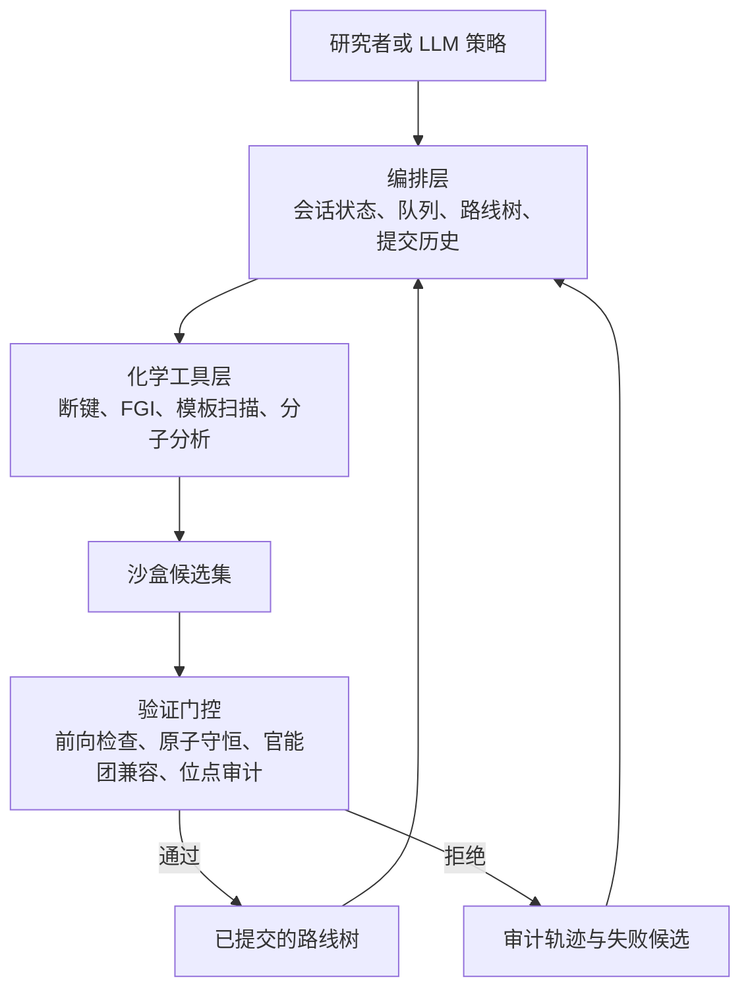
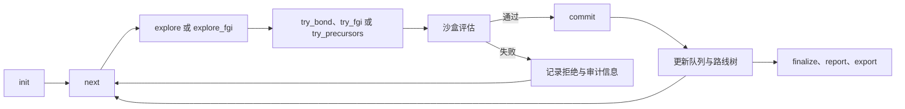
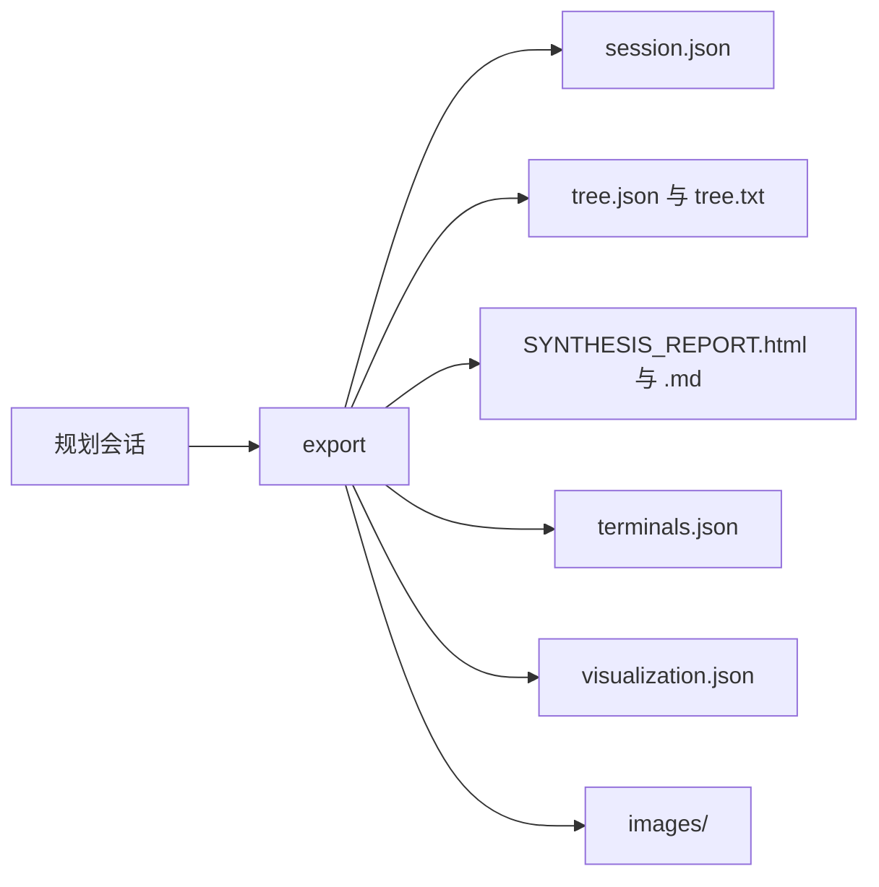

<div align="right">

[English](./README.md) | [简体中文](./README.zh-CN.md)

</div>

<div align="center">

<a id="top"></a>

# Rachel

**面向多步逆合成的形式化化学推理框架**


<p>
  <a href="#trace-demo-zh">流程追踪演示</a> |
  <a href="#why-rachel-zh">为什么是 Rachel</a> |
  <a href="#system-view-zh">系统视图</a> |
  <a href="#selected-molecules-zh">代表性分子</a> |
  <a href="#minimal-quickstart-zh">快速开始</a>
</p>

https://github.com/user-attachments/assets/4dc9990f-00b2-40d8-a8c3-181c6f0c568b

</div>

多步逆合成的难点，不只是为目标分子提出一个局部上看似合理的拆分，还在于要跨步骤维持骨架一致性、官能团兼容性、路线收敛性与前体可执行性。Rachel 的出发点正是这一更严格的问题设定。

Rachel 不把逆合成视为一次性文本生成任务，而是将路线构建形式化为一个持久化的 `state -> action -> validation -> commit` 过程。候选步骤先在沙盒中试探，再经过化学约束下的验证门控，最后才写入主路线树。因此，Rachel 更像一个可检查、可恢复、可比较的规划系统，而不是一个只输出最终答案的生成器。

概括来看，Rachel 结合了：

- 持久化的会话状态，而不是孤立的一次性路线猜测
- 受化学约束的规划操作器，例如断键与 FGI
- 在写入主路线树之前的沙盒候选试验
- 包含前向检查、原子守恒与位点审计的验证门控
- 显式的路线记忆、审计痕迹与可导出的规划产物
- 作为策略层而非化学黑箱的 LLM 引导

<a id="trace-demo-zh"></a>
## 流程追踪演示

上方的 trace 是理解 Rachel 的最快入口。它展示了系统如何从结构化上下文走向候选生成、沙盒验证、门控选择与路线树增长。


- 重点在于规划行为本身，而不仅是最终路线结果
- 被拒绝的尝试不会消失，而会保留为可追踪的规划痕迹
- 这张图适合帮助读者理解 Rachel 在输入目标与导出路线之间究竟做了什么

## 端到端示例

下图展示了 PaRoutes 参考路线与 Rachel 在案例 `n1_366` 上生成结果的全路线级对比。


这个示例的意义不只是单步反应是否看起来合理，而是整条路线在骨架组织、前体解释性和整体结构连贯性上是否仍然成立。

<a id="why-rachel-zh"></a>
## 为什么是 Rachel

很多逆合成系统都能输出“像路线一样”的文本。Rachel 关心的是另一个问题：当中间决策需要保持可见、可复查、可恢复时，一条路线究竟应该如何被**构建**出来？

这一定义会直接改变模型与系统各自的职责：

- 模型负责比较、排序并解释候选动作
- 化学工具层负责生成操作并执行验证门控
- 编排层负责保存状态、路线树结构与决策历史

因此，Rachel 关注的不是“生成一条路线”，而是“组织一个可追踪的决策过程来构建路线”。

## 核心亮点

| 能力 | 在 Rachel 中的体现 |
| --- | --- |
| 有状态规划 | Rachel 基于持久化会话状态进行推理，而不是孤立的一次性回答。 |
| 受化学约束的操作空间 | 键断裂与 FGI 被视为互补的规划操作。 |
| 提交前沙盒试验 | 候选步骤会先在本地沙盒中尝试，再决定是否写入主路线树。 |
| 受验证门控的执行 | 前向可行性、原子守恒等验证器帮助控制是否提交。 |
| 位点感知审计 | 局部位点一致性检查有助于识别“看似合理但位置错了”的前体。 |
| 结构化路线记忆 | 被接受的步骤会成为显式的路线树对象，而不只是自由文本。 |
| 面向审计的规划 | 失败尝试与局部检查结果会被保留下来，作为规划证据。 |
| LLM 作为策略层 | LLM 负责组织搜索与选择，而不是充当不受约束的化学知识源。 |

<a id="system-view-zh"></a>
## 系统视图

基于论文介绍页中的系统框架，Rachel 可以概括为一个分层系统：编排层维护规划会话，化学工具层负责生成和验证候选，LLM 则在压缩后的结构化上下文上承担策略层职责。



这种分层的意义在于：化学事实尽量由工具层约束，而模型主要负责组织搜索与比较候选，避免把关键化学门控混进不可审计的自由文本里。

## 编排视图

Rachel 不只是反应操作器的集合，它还暴露了一套显式的规划协议，使状态迁移变得可读、可追踪。



这也是 Rachel 更像规划系统而不是一次性生成器的原因。候选动作在改变主路线树之前先被验证，而失败不会被静默覆盖，而会留在会话中作为后续判断依据。

## 验证栈

论文式叙述下沉到 README 后，最值得明确的一点就是 Rachel 的验证并不是一个模糊分数，而是一组有职责分工的门控层：

| 验证层 | 作用 |
| --- | --- |
| 前向可执行性 | 检查候选步骤在正向评估下是否仍然合理。 |
| 原子与骨架一致性 | 防止那些文本上看似合理、结构上却已经漂移的错误。 |
| 官能团兼容性 | 在提交前发现局部化学冲突。 |
| 位点感知审计 | 识别同骨架前体在错误取代位点上的假阳性。 |
| 路线状态约束 | 确保被接受的步骤与当前会话和路线树状态一致。 |

## 核心工作流


这是 Rachel 的最紧凑描述。它和普通路线文本生成的区别在于：通过验证的动作会变成持久化的路线对象，而被拒绝的动作依然保留为有信息价值的规划痕迹。

<a id="selected-molecules-zh"></a>
## 代表性分子

Rachel 当前展示了三个定性示例，用于覆盖互补的能力侧面。

<table>
  <tr>
    <td align="center" width="33%">
      <br>
      <strong>QNTR</strong>
    </td>
    <td align="center" width="33%">
      <br>
      <strong>Losartan</strong>
    </td>
    <td align="center" width="33%">
      <br>
      <strong>Rivaroxaban</strong>
    </td>
  </tr>
</table>

| 分子 | 角色 | 路线深度 | 体现的特点 |
| --- | --- | ---: | --- |
| `QNTR` | 具有实验基础的示例 | 6 步 | 一条与真实合成过程相联系的路线，适合对比实验化学与系统规划行为 |
| `Losartan` | 经典药物化学目标 | 4 步 | 体现具有辨识度的药化断裂逻辑与汇聚式路线设计 |
| `Rivaroxaban` | 更深层的类药分子示例 | 5 步 | 展示更长程规划能力与更丰富的转化类型 |

### QNTR

QNTR 是当前 README 中最具实验背景的案例。它并非单纯的 benchmark 分子，而是与一条真实完成过的合成路线相联系，因此特别适合用来判断 Rachel 是否只是在局部命中模板，还是已经开始在路线层面恢复接近实验化学的策略。

在这一案例中，真实合成路线与 Rachel 当前版本都收敛到了相近的三段式拆分思路，并共享若干相近的 terminal building blocks、中间体结构和反应逻辑。更早期的 Rachel 在 FGI 处理和环开合转换上明显更弱，这也正是推动系统向“更具化学可行性”方向演化的重要动因之一。

#### 实验路线


#### 早期 Rachel 路线


#### 当前 Rachel 路线


- 6 步路线，起始于 4 个原料
- 适合作为实验化学与模型规划之间的路线级对照
- 有价值之处在于当前路线体现的是拆分策略，而不只是局部模板满足
- 这组图也保留了 Rachel 早期不足与当前工作流要解决的问题

### Losartan

一个经典的药物化学目标，具有辨识度很高的汇聚式路线。

- 4 步路线，起始于 4 个原料
- 突出展示 tetrazole formation、N-alkylation 与 Suzuki coupling 等逻辑
- 适合作为许多读者都能快速理解的 benchmark 风格示例

### Rivaroxaban

一个更深层的类药分子示例，具有更丰富的转化组合。

- 5 步路线，起始于 4 个原料
- 突出展示 Buchwald-Hartwig amination、FGI、环化以及酰胺形成
- 有助于说明 Rachel 并不局限于短路线或玩具级案例

### 双药物案例对比

下图将 Losartan 与 Rivaroxaban 放在同一张带注释的对比图中。


- `Losartan` 强调经典的汇聚式药物化学逻辑
- `Rivaroxaban` 强调更深的路线深度与更丰富的操作器多样性
- 二者组合有助于读者比较路线风格，而不仅是孤立结果

<a id="minimal-quickstart-zh"></a>
## 最小快速开始

当前本地运行默认你已经准备好了主要研究依赖环境，包括 Python 3.10+、RDKit、`numpy` 和 `Pillow`。

```python
from Rachel.main import RetroCmd

cmd = RetroCmd("my_session.json")

cmd.execute(
    "init",
    {
        "target": "CC(=O)Nc1ccc(O)cc1",
        "name": "Paracetamol",
        "terminal_cs_threshold": 1.5,
    },
)

ctx = cmd.execute("next")

cmd.execute(
    "try_precursors",
    {
        "precursors": ["CC(=O)Cl", "Nc1ccc(O)cc1"],
        "reaction_type": "Schotten-Baumann acylation",
    },
)

cmd.execute(
    "commit",
    {
        "idx": 0,
        "reasoning": "Acylation with simple, accessible precursors.",
        "confidence": "high",
    },
)
```

这是一个协议层面的最小示例，而不是完整 benchmark 工作流。更多技术说明保存在 [usage notes](docs/usage-notes.md) 中。

## 典型输出

一次完整运行导出的并不只是最终答案字符串，而是一组可检查的路线级产物。



典型输出包括：

- `SYNTHESIS_REPORT.html` 与 `SYNTHESIS_REPORT.md`
- 面向正向合成阅读的 `report.txt`
- 便于检查路线结构的 `tree.json` 与 `tree.txt`
- 起始原料列表 `terminals.json`
- 面向前端渲染或后处理的 `visualization.json`
- 用于恢复完整规划状态的 `session.json`
- `images/` 下的分子图、反应图与路线总览图

<details>
<summary><strong>仓库结构</strong></summary>

- [main](main): 编排逻辑、会话逻辑、路线树、报告与命令接口
- [chem_tools](chem_tools): 具备化学约束的操作器与验证工具
- [tools](tools): 运行、分析、可视化及相关研究流程的辅助脚本
- [docs](docs): 使用说明、展示材料与论文配套文档
- [plan](plan): 论文草稿、写作材料与论文准备资源
- [tests](tests): 当前验证与实验支持材料
- [data](data): 数据集、中间产物与实验侧资源
- [assets](assets): 项目图件与辅助可视化材料

</details>

## 项目状态

- 活跃研究代码库
- 正在为面向 arXiv 的展示进行整理
- 核心工作流已经在使用中
- 文档在持续完善，但仓库仍是一个实时演化的研究工作区
- 尚未达到完全打磨后的开源发布状态


