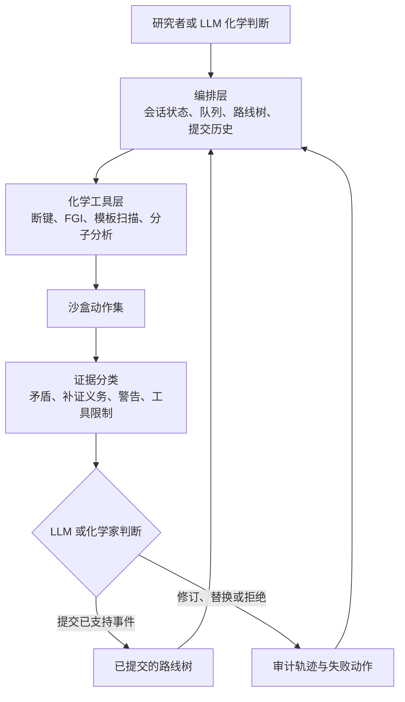
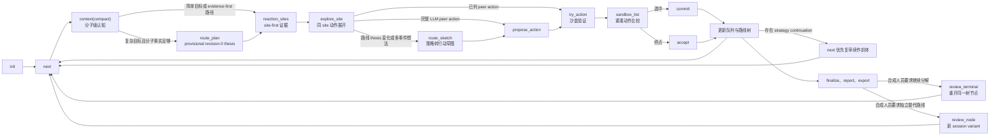
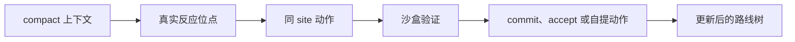
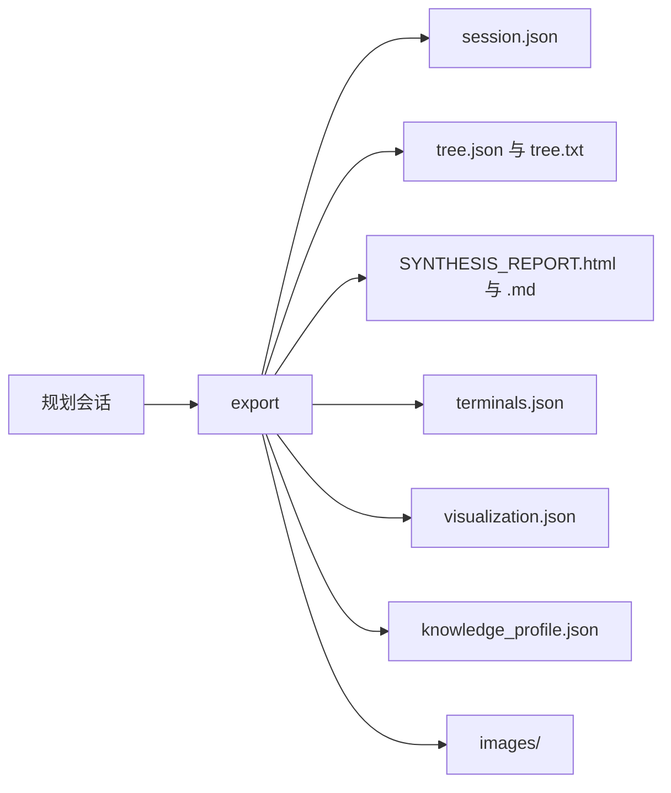

<div align="right">

[English](./README.md) | [简体中文](./README.zh-CN.md)

</div>

<div align="center">

<a id="top"></a>

# Rachel

**以化学信息为基础、由 LLM 主导的多步逆合成框架**

本仓库包含 `Rachel-beta` 运行时，以及论文采用的 PaRoutes120 与 RF25 完整路线结果。项目采用 **CC BY-NC 4.0**
许可证，商业用途不在许可范围内。许可说明见 [`LICENSE`](./LICENSE)。


<p>
  <a href="#trace-demo-zh">流程追踪演示</a> |
  <a href="#why-rachel-zh">为什么是 Rachel</a> |
  <a href="#system-view-zh">系统视图</a> |
  <a href="#complete-route-results-zh">完整路线结果</a> |
  <a href="#minimal-quickstart-zh">快速开始</a>
</p>

https://github.com/user-attachments/assets/4dc9990f-00b2-40d8-a8c3-181c6f0c568b

</div>

## 可插拔知识包与受控经验学习

每个 session 在 `init` 时固定 `rachel.base + team + project` 的知识组合，并保存 pack ID、不可变版本、manifest SHA-256 与组合 digest。reload、路线 variant 和 export 继承同一 profile；缺包或哈希变化会明确失败，活跃 session 不热更新。

外部 pack 只能提供 JSON 形式的 prompt、经验卡、reaction、SMARTS、Smart CAP、family 与风险资源，不能执行 Python，也不能弱化锁定的 contradiction、原子守恒、拓扑或 validation gate。公共报告只显示 pack 身份、哈希与命中条目 ID，不复制专有正文或本地路径。

`committed` 只表示规划步骤写入路线树，不代表实验成功。实验事实使用 `record_outcome` 单独记录；finalized 路线可用 `learning_review` 汇总，再由 `propose_knowledge` 生成 `active=false` 的 staging 草稿。专家 approve 仍不会激活草稿，只有独立 pack CLI 发布的新不可变版本才能供后续 session 选择。

```python
cmd.execute("init", {
    "target": "CC(=O)Nc1ccc(O)cc1",
    "knowledge_profile": ["team.acme@1.2.0", "project.alpha@3.0.0"],
    "knowledge_roots": ["knowledge_packs"],
})
```

已发布的[知识包目录](Rachel/knowledge)包含资源文件、profile 实现和[命令行工具](Rachel/knowledge/cli.py)。

多步逆合成的难点，不只是为目标分子提出一个局部上看似合理的拆分，还在于要跨步骤维持骨架一致性、官能团兼容性、路线收敛性与前体可执行性。Rachel 的出发点正是这一更严格的问题设定。

Rachel 的核心哲学可以概括为三点：Rachel 只提供结构化化学信息而不替代化学判断；化学真实合理与整条路线的质量永远优先；路线设计可以大胆假设、大胆创新，但每一个提交步骤都必须严格验证、严格审计。模板、Smart CAP、反应家族名、评分和 gate 都是辅助信息，真正的路线与反应决策仍由 LLM 或化学家完成。

Rachel 不把逆合成视为一次性文本生成任务，而是将路线构建形式化为一个持久化的 `state -> action -> validation -> commit` 过程。动作步骤先在沙盒中试探，再经过化学约束下的验证门控，最后才写入主路线树。因此，Rachel 更像一个可检查、可恢复、可比较的规划系统，而不是一个只输出最终答案的生成器。

概括来看，Rachel 结合了：

- 持久化的会话状态，而不是孤立的一次性路线猜测
- 作为参考化学空间的断键、FGI、模板与 Smart CAP
- 在写入主路线树之前的沙盒动作试验
- 包含前向检查、原子守恒与位点审计的验证门控
- 显式的路线记忆、审计痕迹与可导出的规划产物
- 在结构化化学证据上主动设计路线与反应的 LLM

<a id="trace-demo-zh"></a>
## 流程追踪演示

上方的 trace 是理解 Rachel 的最快入口。它展示了系统如何从结构化上下文走向动作生成、沙盒验证、证据分类、LLM/化学家选择与路线树增长。


- 重点在于规划行为本身，而不仅是最终路线结果
- 被拒绝的尝试不会消失，而会保留为可追踪的规划痕迹
- 这张图适合帮助读者理解 Rachel 在输入目标与导出路线之间究竟做了什么

<a id="complete-route-results-zh"></a>
## 完整路线结果

论文采用的 PaRoutes120 与 RF25 完整路线对比已放入
[data/route-atlas](data/route-atlas/README.md)，包括 Rachel 的 GPT-5.5
结果、各对比方法，以及 PaRoutes 的参考路线。

| 数据集 | 覆盖范围 | 离线路线页面 | 结构化记录 |
| --- | --- | --- | --- |
| PaRoutes120 | 全部 120 个目标、8 种方法及 120 条 Reference 路线 | [PaRoutes120.html](data/route-atlas/PaRoutes120.html) | [PaRoutes120.json](data/route-atlas/data/PaRoutes120.json) |
| RF25 | 全部 25 个目标、4 种方法 | [RF25.html](data/route-atlas/RF25.html) | [RF25.json](data/route-atlas/data/RF25.json) |

通过 **Code > Download ZIP** 下载并解压仓库，或使用 Git 克隆，然后在浏览器中
打开任一 HTML 文件。GitHub 文件页本身不运行交互页面；本地浏览不需要服务器、
API key 或 Python 环境。

选择目标编号后即可并排比较不同方法的路线，查看分子结构、反应步骤、路线结果，
以及已有的匹配评价和末端来源记录。未完成或未取得路线的结果也保留在页面中。
PaRoutes120 默认对照 Rachel 与 Reference，RF25 默认对照 Rachel 与 Direct LLM。

[路线索引](data/route-atlas/ROUTE_INDEX.csv)包含全部 1,180 个对比位置：
1,060 个方法结果和单独列出的 120 条 Reference。
[字段说明](data/route-atlas/DATA_DICTIONARY.md)解释 JSON 数据结构；
[数据说明](data/route-atlas/README.md)记录路线版本及来源差异。
这里收录的是论文采用的计算结果，没有重新生成路线。严格闭合表示规划完成且末端
均通过独立来源解析，不代表实验室合成完成。

<a id="why-rachel-zh"></a>
## 为什么是 Rachel

很多逆合成系统都能输出“像路线一样”的文本。Rachel 关心的是另一个问题：当中间决策需要保持可见、可复查、可恢复时，一条路线究竟应该如何被**构建**出来？

这一定义会形成清晰的职责边界：

- LLM 或化学家负责路线假设、反应设计、前体补全、证据协调和 terminal 决策
- 化学工具层负责提供分子事实、候选空间脚手架、原子来源/拓扑/位点观察和验证结果
- 编排层负责保存状态、路线树结构与决策历史
- gate 负责区分矛盾、补证义务、警告和工具限制，不负责替 LLM 选择反应

因此，Rachel 关注的不是“生成一条路线”，而是“在可追踪流程中大胆提出化学假设，并在改变路线树之前强制完成严格验证”。

## 核心亮点

| 能力 | 在 Rachel 中的体现 |
| --- | --- |
| 有状态规划 | Rachel 基于持久化会话状态进行推理，而不是孤立的一次性回答。 |
| 参考化学空间 | 断键、FGI、模板和 Smart CAP 提供候选化学空间，但不定义逆合成边界。 |
| 提交前沙盒试验 | 动作步骤会先在本地沙盒中尝试，再决定是否写入主路线树。 |
| 证据分类 gate | 前向检查、原子守恒、拓扑和位点审计区分真实矛盾、补证义务、警告与工具限制。 |
| 位点感知审计 | 局部位点一致性检查有助于识别“看似合理但位置错了”的前体。 |
| 拓扑与原子来源证明 | 高风险成环/并环/骨架编辑会同时携带 atom-mapped 证据、家族解释与可 override 的审计提示。 |
| 结构化路线记忆 | 被接受的步骤会成为显式的路线树对象，而不只是自由文本。 |
| 面向审计的规划 | 失败尝试与局部检查结果会被保留下来，作为规划证据。 |
| LLM 作为化学决策层 | LLM 可以提出系统未列出的化学方案并负责最终路线判断，但每次提交必须可审计。 |

## 当前规划契约

- Rachel 已列 action 与完整的 LLM 自提一步 action 是并列假设。自提 action
  应先建立正向化学论证；比较和 rejected ID 只是按需记录的次要 provenance。
- 复杂目标可以先登记短 provisional 路线 thesis，再用 Rachel 的 site/action
  证据支持、证伪、丰富或修订它；分子级事实不足时也可以先收集位点证据。
- Discovery 负责路线设计、收敛性、骨架/手柄策略和候选生成；Audit 只在相关
  证据存在时暴露对应验证状态的处理要求。
- 经验卡是按相关性匹配的动态提醒，不是化学裁决，也不是必须填满的数量指标；
  稀疏上下文可以保持稀疏。
- `review_terminal` 会在原路线树中重新打开同一个 terminal leaf。新增路线仍走
  标准规划流程，闭合后必须再次显式 `finalize`。
- `review_node` 从 finalized 路线中的指定节点创建并自动激活独立 session variant；
  它既可继续拆 terminal，也可替换 target 或 intermediate 的旧展开，且不写父 session。

<a id="system-view-zh"></a>
## 系统视图

Rachel 可以概括为一个分层系统：编排层维护规划会话，化学工具层提供事实、候选提示和验证证据，LLM 或化学家则在压缩后的结构化上下文上设计并选择化学方案。


```mermaid
flowchart TB
    U["研究者或 LLM 化学判断"] --> O["编排层<br/>会话状态、队列、路线树、提交历史"]
    O --> C["化学工具层<br/>断键、FGI、模板扫描、分子分析"]
    C --> S["沙盒动作集"]
    S --> V["证据分类<br/>矛盾、补证义务、警告、工具限制"]
    V --> D{"LLM 或化学家判断"}
    D -->|提交已支持事件| T["已提交的路线树"]
    D -->|修订、替换或拒绝| A["审计轨迹与失败动作"]
    T --> O
    A --> O
```

这种分层的意义在于：确定性工具负责建立可检查的事实，模型可以挑战弱模板并提出更好的化学，但任何未经审计的事件都不能直接写入路线树。

## 编排视图

Rachel 不只是反应操作器的集合，它还暴露了一套显式的规划协议，使状态迁移变得可读、可追踪。


```mermaid
flowchart LR
    I["init"] --> N["next"]
    N --> X["context(compact)<br/>分子级认知"]
    X -->|复杂目标且分子事实足够| RP["route_plan<br/>provisional revision-0 thesis"]
    X -->|简单目标或 evidence-first 路径| S1["reaction_sites<br/>site-first 证据"]
    RP --> S1
    S1 --> S2["explore_site<br/>同 site 动作展开"]
    S2 -->|已列 peer action| T["try_action<br/>沙盒验证"]
    S2 -->|完整 LLM peer action| P["propose_action"]
    S2 -->|路线 thesis 变化或多事件想法| RS["route_sketch<br/>策略转行动草图"]
    RS --> P
    P --> T
    T --> L["sandbox_list<br/>紧凑动作比较"]
    L -->|选中| C["commit"]
    L -->|终点| A["accept"]
    C --> Q["更新队列与路线树"]
    A --> Q
    Q --> N
    Q -->|存在 strategy continuation| RC["next 优先复审续作前体"]
    RC --> N
    Q --> F["finalize、report、export"]
    F -->|合成人员要求继续分解| R["review_terminal<br/>重开同一树节点"]
    R --> N
    F -->|合成人员要求独立替代路线| V["review_node<br/>新 session variant"]
    V --> N
```

这也是 Rachel 更像规划系统而不是一次性生成器的原因。provisional
`route_plan` 可以被位点证据挑战并补全；已列 action 与 LLM 自提 action 走同一条
sandbox 路径；`route_sketch` 用于路线级转换、多事件想法和 terminal review，
而不是作为自提化学的许可。当 mini-route 需要多个真实事件时，持久 continuation
会保持后续前体可见。重新打开的 terminal 也会回到同一流程，而不是进入独立修补旁路。

## 验证栈

论文式叙述下沉到 README 后，最值得明确的一点就是 Rachel 的验证并不是一个模糊分数，而是一组有职责分工的门控层：

| 验证层 | 作用 |
| --- | --- |
| 前向可执行性 | 检查动作步骤在正向评估下是否仍然合理。 |
| 原子与骨架一致性 | 防止那些文本上看似合理、结构上却已经漂移的错误。 |
| 官能团兼容性 | 在提交前发现局部化学冲突。 |
| 位点感知审计 | 识别同骨架前体在错误取代位点上的假阳性。 |
| 路线状态约束 | 确保被接受的步骤与当前会话和路线树状态一致。 |

验证结果不再只看一个分数，而是面向 commit 暴露为可解释门控：

- `blocked`：不能提交；区分化学矛盾与 validator/system error
- `proof_required`：先补 atom source、位点、tether、anchor 或机制证据，再考虑 override
- `inconclusive`：把化学证据缺口与模板/工具覆盖不足分开判断
- `warning`：提交前必须明确处理风险
- `clear`：gate 无异议，但仍需正常化学审查

公共 `RetroCmd` 验证输出统一使用 `rachel.validation.v2`。历史 session 中的
`forward_validation`、`validation_micro`、`evidence_packet` 仍可读取，但不再是
默认 LLM-facing 协议。

反应 family 名称和正向模板覆盖只是证明义务提示，不是硬门控本身。family
不匹配、自定义反应名未知或 `template_not_attempted` 应要求更强的原子来源和位点保真证据；
只有原子/骨架不守恒、禁忌官能团或真实拓扑 hard fail 这类明确化学矛盾才应直接阻断。
反应性有机金属前体字符串会先 preflight 归一化为有机来源前体加金属来源义务，再进入 verdict。

## 核心工作流


```mermaid
flowchart LR
    A["compact 上下文"] --> B["真实反应位点"]
    B --> C["同 site 动作"]
    C --> D["沙盒验证"]
    D --> E["commit、accept 或自提动作"]
    E --> F["更新后的路线树"]
```

这是 Rachel 的最紧凑描述。它和普通路线文本生成的区别在于：通过验证的动作会变成持久化的路线对象，而被拒绝的动作依然保留为有信息价值的规划痕迹。

<a id="minimal-quickstart-zh"></a>
## 最小快速开始

当前本地运行默认你已经准备好了主要研究依赖环境，包括 Python 3.10+、RDKit、`numpy` 和 `Pillow`。

```python
from Rachel.main import RetroCmd

cmd = RetroCmd("my_session.json")

cmd.execute(
    "init",
    {
        "target": "CC(=O)Nc1ccc(O)cc1",
        "name": "Paracetamol",
        "terminal_cs_threshold": 1.5,
    },
)

ctx = cmd.execute("next", {})
sites = cmd.execute("reaction_sites", {})

site_id = sites["site_reaction_map"][0]["site_id"]
detail = cmd.execute("explore_site", {"site_id": site_id})

# 已列 action 与完整 LLM 自提 action 是并列假设。此开关仅用于同时展示
# 两条 API 分支；正常运行应根据化学质量和路线连贯性选择。
use_llm_peer = False
if use_llm_peer:
    peer = cmd.execute(
        "propose_action",
        {
            "precursors": ["CC(=O)Cl", "Nc1ccc(O)cc1"],
            "reagents": ["CCN(CC)CC"],
            "reaction_name": "Schotten-Baumann acylation",
            "action_label": "peer acetylation precursor set",
            "why_existing_actions_rejected": "",
            "rationale_summary": "Acetyl chloride supplies the acetyl carbonyl, p-aminophenol supplies the amide nitrogen and aryl-phenol skeleton, and base captures HCl; this is one chemoselective amide-forming event at the aniline nitrogen.",
            "risk_tags": ["custom_precursor", "atom_accounting", "chemoselectivity"],
        },
    )
    action_id = peer["action_id"]
else:
    action_id = detail["actions"][0]["action_id"]

attempt = cmd.execute("try_action", {"action_id": action_id})
sandbox = cmd.execute("sandbox_list", {})
validation = attempt["validation"]

committed = cmd.execute(
    "commit",
    {
        "idx": attempt["attempt_idx"],
        "expected_action_id": action_id,
        "reasoning": "写清 site、前体、原子账、validation 和被拒动作审计。",
        "confidence": "medium",
        "rejected": [],
    },
)
assert committed.get("step_id")
```

当合成人员要求继续分解已关闭或历史路线中的 terminal 时，应重新打开原树节点，
而不是创建脱离原树的分析：

```python
cmd.execute("review_terminal", {
    "smiles": terminal_smiles,
    "reason": "chemist requests deeper decomposition",
    "additional_steps": 10,
})
```

该节点会返回标准 `next`/site/action/validation/commit 流程；扩展路线闭合后，
仍需再次显式调用 `finalize`。

若要从 finalized 路线的任意节点建立独立替代路线，应创建新的 session variant。
首选 `node_id`，也兼容 `smiles`；同时提供时必须解析到同一节点：

```python
cmd.execute("review_node", {
    "node_id": review_node_id,
    "reason": "使用合成人员指定方案替换该分支",
    "instruction": "使用指定反应并避开高危试剂类别",
    "constraints": ["保留核心骨架"],
    "variant_session_file": "runs/route_variant.json",
    "additional_steps": 10,
})
```

finalized 父文件保持不变，`RetroCmd` 自动切换到新 variant。terminal 进入继续拆分；
target 或已展开 intermediate 仅在 variant 中移除旧的下游展开。共享 convergence node
和保留前缀维持原 ID。原始指导写入 variant JSON，默认 prompt 只接收紧凑摘要。
本地文件路径可控不等于实际部署所调用的外部模型服务对这些指令提供保密保证。

这是一个协议层面的最小示例，而不是完整 benchmark 工作流。可执行的 LLM 契约见
[skill.md](Rachel/skill.md)，命令实现见
[retro_cmd.py](Rachel/main/retro_cmd.py)。

## 典型输出

一次完整运行导出的并不只是最终答案字符串，而是一组可检查的路线级产物。


```mermaid
flowchart LR
    S["规划会话"] --> E["export"]
    E --> A["session.json"]
    E --> B["tree.json 与 tree.txt"]
    E --> C["SYNTHESIS_REPORT.html 与 .md"]
    E --> D["terminals.json"]
    E --> F["visualization.json"]
    E --> H["knowledge_profile.json"]
    E --> G["images/"]
```

典型输出包括：

- `SYNTHESIS_REPORT.html` 与 `SYNTHESIS_REPORT.md`
- 面向正向合成阅读的 `report.txt`
- 便于检查路线结构的 `tree.json` 与 `tree.txt`
- 起始原料列表 `terminals.json`
- 面向前端渲染或后处理的 `visualization.json`
- 记录固定 pack ID、版本与哈希的 `knowledge_profile.json`
- 用于恢复完整规划状态的 `session.json`
- `images/` 下的分子图、反应图与路线总览图

<details>
<summary><strong>仓库结构</strong></summary>

- [main](Rachel/main): 编排逻辑、会话逻辑、路线树、报告与命令接口
- [chem_tools](Rachel/chem_tools): 具备化学约束的操作器与验证工具
- [tools](Rachel/tools): 运行、分析、可视化及相关研究流程的辅助脚本
- [knowledge](Rachel/knowledge): 固定的 base/team/project profile、来源追踪、staging、冲突 gate 与不可变发布
- [skill.md](Rachel/skill.md): LLM 面向的硬规则与命令契约
- [experience_cards.json](Rachel/experience_cards.json): 结构化经验提示
- [data/route-atlas](data/route-atlas/README.md)：论文完整路线对比、JSON 记录与来源索引

</details>

## 项目状态

- 已公开的 Rachel-beta 研究运行时，采用 CC BY-NC 4.0。
- 论文采用的 PaRoutes120 与 RF25 完整路线对比收录于 `data/route-atlas`。
- 论文与投稿材料另行准备。
- 结果保留各实验实际使用的版本信息，不能假定后续加入的运行时功能在所有历史运行中均已启用。
