# target_molecule — 逆合成规划报告

**目标分子 SMILES**: `CC(C)(C)NC(=O)[C@@H]1C[C@@H]2CCCC[C@@H]2CN1C[C@@H](O)[C@H](Cc1ccccc1)NC(=O)[C@H](CC(N)=O)NC(=O)c1ccc2ccccc2n1`

**状态**: complete | **总步数**: 11 | **最大深度**: 9

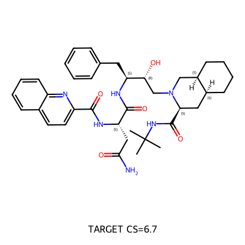

## 合成路线总览

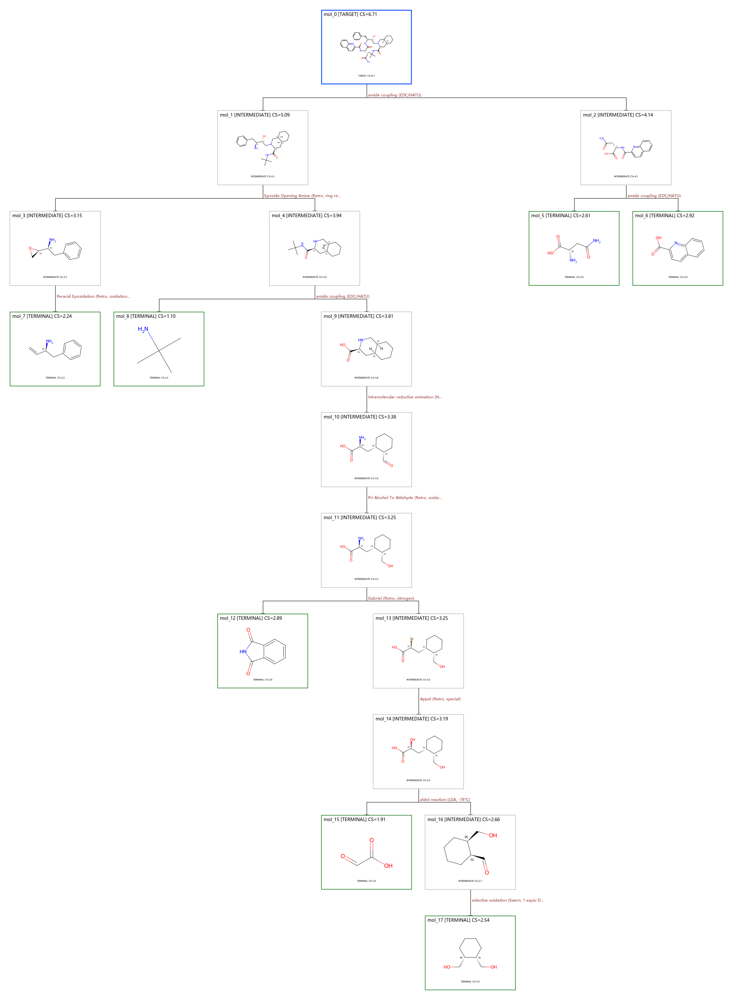

## 起始原料 (7 种)

| 编号 | SMILES | CS Score | 分类 | 图像 |
|------|--------|----------|------|------|
| 1 | `O=C1NC(=O)c2ccccc21` | 2.89 | moderate | 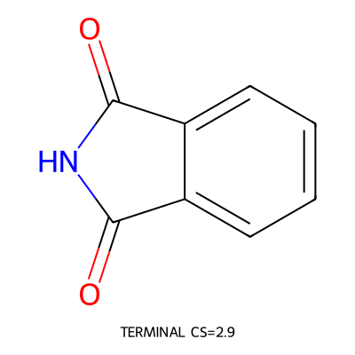 |
| 2 | `O=CC(=O)O` | 1.91 | trivial | 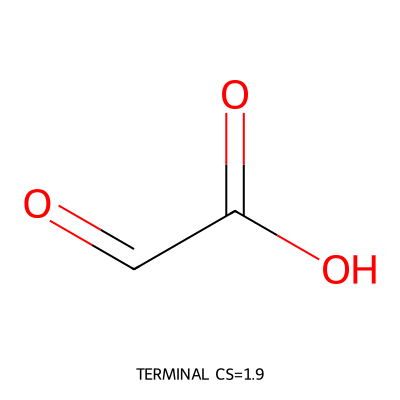 |
| 3 | `OC[C@@H]1CCCC[C@@H]1CO` | 2.54 | moderate | 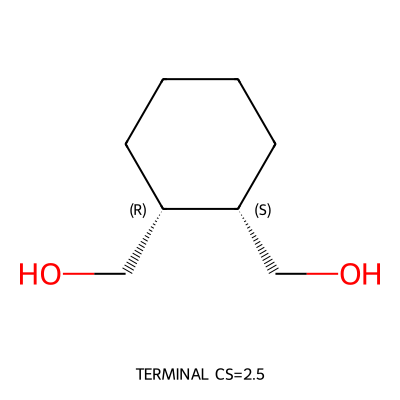 |
| 4 | `NC(=O)C[C@H](N)C(=O)O` | 2.61 | moderate | 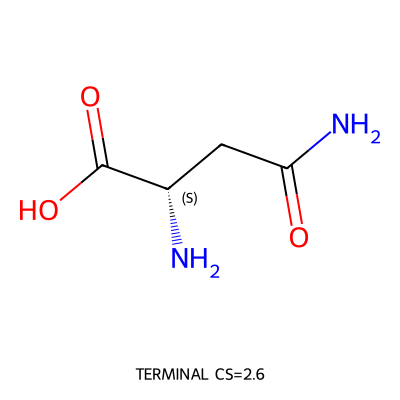 |
| 5 | `O=C(O)c1ccc2ccccc2n1` | 2.92 | moderate | 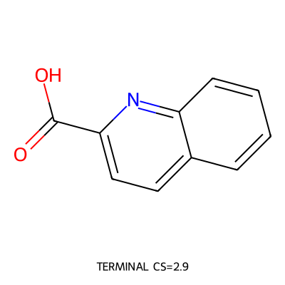 |
| 6 | `C=C[C@@H](N)Cc1ccccc1` | 2.24 | trivial | 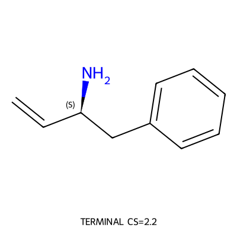 |
| 7 | `CC(C)(C)N` | 1.10 | trivial | 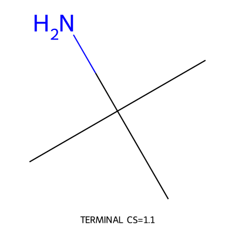 |

## 正向合成步骤 (11 步)

### Step 1: selective oxidation (Swern, 1 equiv DMSO/oxalyl chloride)

**反应**: `OC[C@@H]1CCCC[C@@H]1CO>>O=C[C@H]1CCCC[C@H]1CO`

**前体**:

- `OC[C@@H]1CCCC[C@@H]1CO` [terminal]
  

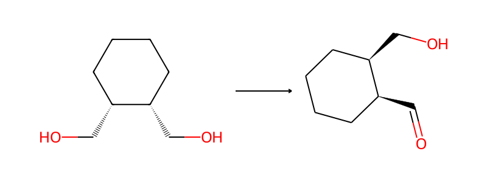

**产物**: `O=C[C@H]1CCCC[C@H]1CO`

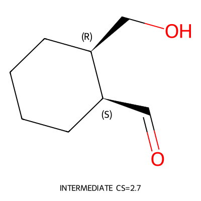

- **选择理由**: FGI：2-(羟甲基)环己烷甲醛 ← 选择性 Swern 氧化 ← trans-1,2-环己烷二甲醇。用 1 当量 Swern 试剂选择性氧化一个伯醇为醛。产物 trans-1,2-环己烷二甲醇 (OC[C@@H]1CCCC[C@@H]1CO, CS=2.54) 是简单二醇，接近 terminal。feasibility=0.79, pass=true, atom_balance=true。
- **置信度**: 0.82
- **被拒绝**:
  - 直
  - 接
  - 断
  - 环
  - 己
  - 烷
  -  
  - C
  - -
  - C
  -  
  - 键
  - 不
  - 合
  - 理
  - 。

### Step 2: amide coupling (EDC/HATU)

**反应**: `NC(=O)C[C@H](N)C(=O)O.O=C(O)c1ccc2ccccc2n1>>NC(=O)C[C@H](NC(=O)c1ccc2ccccc2n1)C(=O)O`

**前体**:

- `NC(=O)C[C@H](N)C(=O)O` [terminal]
  

- `O=C(O)c1ccc2ccccc2n1` [terminal]
  

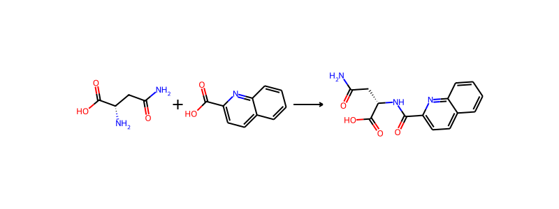

**产物**: `NC(=O)C[C@H](NC(=O)c1ccc2ccccc2n1)C(=O)O`

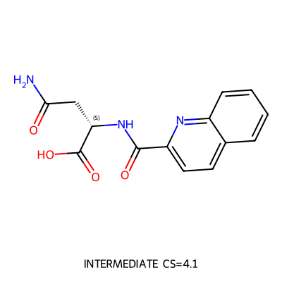

- **选择理由**: 断裂 bond_idx 1（仲酰胺键，atoms 5,6），采用 EDC/HATU 酰胺偶联逆合成。产生：(1) L-天冬酰胺 (NC(=O)C[C@H](N)C(=O)O, CS=2.61)——天然氨基酸，商购原料；(2) 喹啉-2-甲酸 (O=C(O)c1ccc2ccccc2n1, CS=2.92)——商购原料。feasibility=0.80, pass=true, atom_balance=true。保护基审查：L-天冬酰胺有游离 α-NH₂、-COOH 和伯酰胺 -CONH₂。EDC/HATU 偶联中，α-NH₂ 亲核性远高于伯酰胺 -NH₂，可选择性反应。-COOH 可能需要先保护为甲酯，但在实际操作中可通过控制当量和反应顺序解决。
- **置信度**: 0.82
- **被拒绝**:
  - 酰
  - 氯
  - 法
  -  
  - (
  - c
  - o
  - n
  - f
  - =
  - 0
  - .
  - 8
  - )
  -  
  - 也
  - 可
  - 行
  - ，
  - 但
  - 酰
  - 氯
  - 对
  - 游
  - 离
  -  
  - -
  - N
  - H
  - ₂
  -  
  - 和
  -  
  - -
  - O
  - H
  -  
  - 选
  - 择
  - 性
  - 差
  - ，
  - 需
  - 要
  - 更
  - 多
  - 保
  - 护
  - 步
  - 骤
  - 。

### Step 3: Peracid Epoxidation (Retro, oxidation reduction)

**反应**: `C=C[C@@H](N)Cc1ccccc1>>N[C@@H](Cc1ccccc1)[C@H]1CO1`

**前体**:

- `C=C[C@@H](N)Cc1ccccc1` [terminal]
  

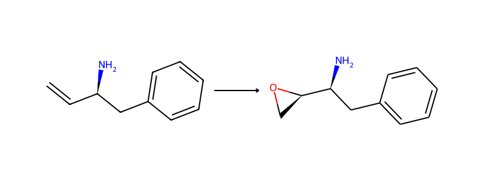

**产物**: `N[C@@H](Cc1ccccc1)[C@H]1CO1`

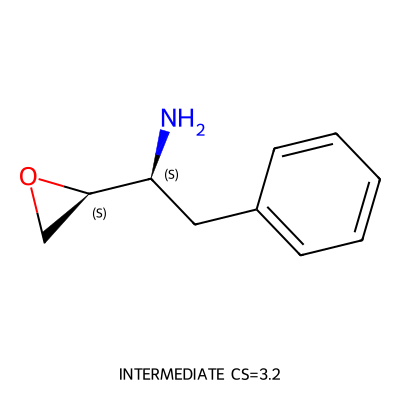

- **选择理由**: 环氧化物通过 mCPBA 或 Sharpless 不对称环氧化从烯丙基胺制备。FGI 逆向：环氧 → 烯烃（Peracid Epoxidation Retro）。产物 C=C[C@@H](N)Cc1ccccc1 是 (S)-2-氨基-4-苯基-1-丁烯，CS=2.24，标记为 terminal。feasibility=0.93, pass=true。保护基审查：实际操作中需先 Boc 保护 -NH₂ 再环氧化（mCPBA 可能氧化游离胺），但这是正向合成的操作细节，逆合成树中环氧化物作为中间体是合理的。Sharpless AE 可控制环氧的立体化学。
- **置信度**: 0.85
- **被拒绝**:
  - 卤
  - 代
  - 醇
  - 关
  - 环
  - 方
  - 案
  -  
  - f
  - e
  - a
  - s
  - i
  - b
  - i
  - l
  - i
  - t
  - y
  - =
  - 0
  - .
  - 6
  - 6
  -  
  - 较
  - 低
  - ，
  - 且
  - 产
  - 物
  - 含
  - 通
  - 配
  - 符
  - 。
  - 直
  - 接
  - 断
  -  
  - C
  - -
  - C
  -  
  - 键
  - （
  - b
  - o
  - n
  - d
  - _
  - i
  - d
  - x
  -  
  - 2
  - ,
  -  
  - N
  - e
  - g
  - i
  - s
  - h
  - i
  - ）
  - 会
  - 破
  - 坏
  - 手
  - 性
  - 中
  - 心
  - 。

### Step 4: aldol reaction (LDA, -78°C)

**反应**: `O=CC(=O)O.O=C[C@H]1CCCC[C@H]1CO>>O=C(O)[C@@H](O)C[C@@H]1CCCC[C@@H]1CO`

**前体**:

- `O=CC(=O)O` [terminal]
  

- `O=C[C@H]1CCCC[C@H]1CO` [intermediate]
  

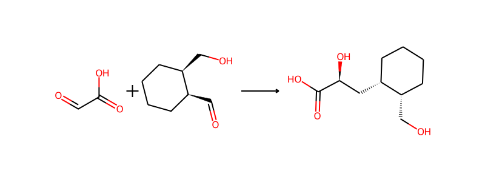

**产物**: `O=C(O)[C@@H](O)C[C@@H]1CCCC[C@@H]1CO`

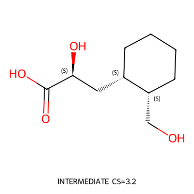

- **选择理由**: Aldol 反应断裂 C-C 键（bond_idx 2, atoms 3,5）。乙醛酸（glyoxylic acid, CS=1.91, terminal）作为亲电体，2-(羟甲基)环己烷甲醛（CS=2.66）的 α-碳烯醇化后进攻乙醛酸的醛基。LDA/-78°C 条件下可控制 aldol 的立体选择性。feasibility=0.83, pass=true。保护基审查：乙醛酸的 -COOH 在碱性 aldol 条件下可能脱质子，但不影响反应。环己烷甲醛的 -CH₂OH 在 LDA 条件下需要 TBS 保护。
- **置信度**: 0.8
- **被拒绝**:
  - G
  - r
  - i
  - g
  - n
  - a
  - r
  - d
  -  
  - 方
  - 案
  -  
  - c
  - o
  - n
  - f
  - =
  - 0
  - .
  - 4
  - 5
  - ，
  - 需
  - 要
  - 制
  - 备
  -  
  - G
  - r
  - i
  - g
  - n
  - a
  - r
  - d
  -  
  - 试
  - 剂
  - ，
  - 步
  - 骤
  - 更
  - 多
  - 。

### Step 5: Appel (Retro, special)

**反应**: `O=C(O)[C@@H](O)C[C@@H]1CCCC[C@@H]1CO>>O=C(O)[C@@H](Br)C[C@@H]1CCCC[C@@H]1CO`

**前体**:

- `O=C(O)[C@@H](O)C[C@@H]1CCCC[C@@H]1CO` [intermediate]
  

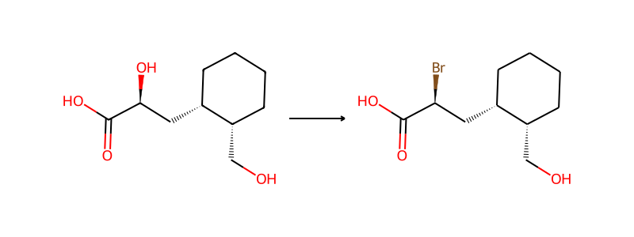

**产物**: `O=C(O)[C@@H](Br)C[C@@H]1CCCC[C@@H]1CO`

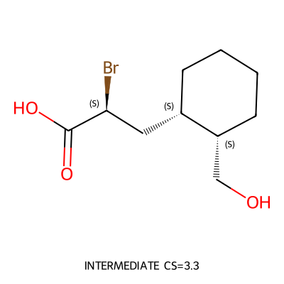

- **选择理由**: FGI：α-溴代酸 ← Appel 反应 ← α-羟基酸。Appel 反应（PPh₃, CBr₄）将 α-OH 转化为 α-Br，立体翻转（SN2）。产物 O=C(O)[C@@H](O)C[C@@H]1CCCC[C@@H]1CO (CS=3.20)。feasibility=0.93, pass=true。保护基审查：Appel 条件下 -COOH 稳定，伯醇 -CH₂OH 也可能被溴化——需要先 TBS 保护伯醇。
- **置信度**: 0.83
- **被拒绝**:
  - 直
  - 接
  - 从
  - 羧
  - 酸
  -  
  - H
  - V
  - Z
  -  
  - 溴
  - 化
  - 没
  - 有
  - 对
  - 应
  - 的
  -  
  - F
  - G
  - I
  -  
  - 模
  - 板
  - 。
  - P
  - i
  - n
  - n
  - i
  - c
  - k
  -  
  - 逆
  - 向
  - 只
  - 改
  - 变
  - 氧
  - 化
  - 态
  - 不
  - 去
  - 溴
  - 。

### Step 6: Gabriel (Retro, nitrogen)

**反应**: `O=C1NC(=O)c2ccccc21.O=C(O)[C@@H](Br)C[C@@H]1CCCC[C@@H]1CO>>N[C@@H](C[C@@H]1CCCC[C@@H]1CO)C(=O)O`

**前体**:

- `O=C1NC(=O)c2ccccc21` [terminal]
  

- `O=C(O)[C@@H](Br)C[C@@H]1CCCC[C@@H]1CO` [intermediate]
  

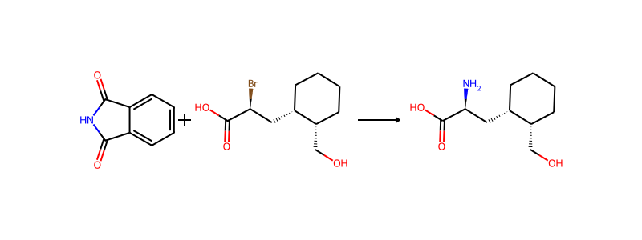

**产物**: `N[C@@H](C[C@@H]1CCCC[C@@H]1CO)C(=O)O`

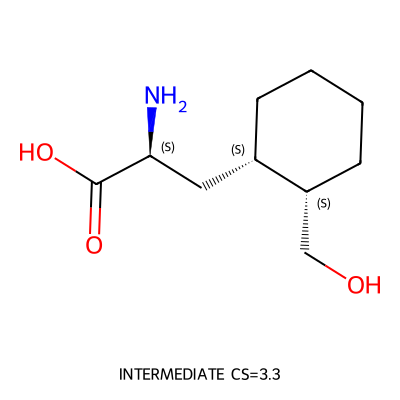

- **选择理由**: Gabriel 合成引入氨基。断裂 C-N 键（bond_idx 0, atoms 0,1）。邻苯二甲酰亚胺（phthalimide, CS=2.89）是标准商购试剂，与 α-溴代酸 SN2 反应后肼解脱保护得到游离胺。α-溴代酸 O=C(O)[C@@H](Br)C[C@@H]1CCCC[C@@H]1CO (CS=3.26) 需继续拆解——可从对应的 α-羟基酸或直接从丙二酸酯烷基化得到。feasibility=0.91, pass=true。保护基审查：α-溴代酸的 -OH 和 -COOH 在 Gabriel 反应条件（DMF, K₂CO₃）下稳定。
- **置信度**: 0.85
- **被拒绝**:
  - S
  - N
  - 2
  -  
  - 胺
  - 化
  - 方
  - 案
  - 需
  - 要
  - 过
  - 量
  -  
  - N
  - H
  - ₃
  - ，
  - 选
  - 择
  - 性
  - 差
  - 。
  - 环
  - 氧
  - 开
  - 环
  - 方
  - 案
  - 产
  - 生
  - 的
  - 前
  - 体
  - 不
  - 合
  - 理
  - 。

### Step 7: Pri Alcohol To Aldehyde (Retro, oxidation reduction)

**反应**: `N[C@@H](C[C@@H]1CCCC[C@@H]1CO)C(=O)O>>N[C@@H](C[C@@H]1CCCC[C@@H]1C=O)C(=O)O`

**前体**:

- `N[C@@H](C[C@@H]1CCCC[C@@H]1CO)C(=O)O` [intermediate]
  

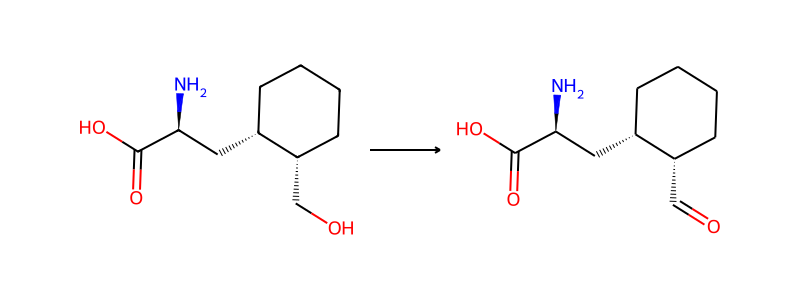

**产物**: `N[C@@H](C[C@@H]1CCCC[C@@H]1C=O)C(=O)O`

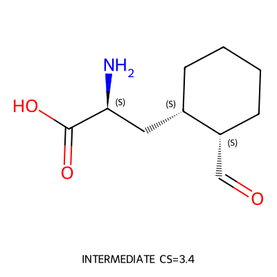

- **选择理由**: FGI：醛 → 伯醇（Swern/Dess-Martin 氧化逆向）。将不稳定的醛基转化为更稳定的伯醇，便于后续操作。产物 N[C@@H](C[C@@H]1CCCC[C@@H]1CO)C(=O)O (CS=3.26)。feasibility=0.99, pass=true。正向合成中，最后一步 Swern 或 Dess-Martin 氧化伯醇得到醛。保护基审查：氧化条件下 -NH₂ 需要 Boc 保护，-COOH 可能需要酯保护。
- **置信度**: 0.85
- **被拒绝**:
  - C
  - u
  - r
  - t
  - i
  - u
  - s
  -  
  - 逆
  - 向
  -  
  - p
  - a
  - s
  - s
  - =
  - f
  - a
  - l
  - s
  - e
  -  
  - (
  - s
  - k
  - e
  - l
  - e
  - t
  - o
  - n
  - _
  - i
  - m
  - b
  - a
  - l
  - a
  - n
  - c
  - e
  - )
  - 。
  - 直
  - 接
  - 从
  - 酮
  - 酸
  - 还
  - 原
  - 胺
  - 化
  -  
  - p
  - a
  - s
  - s
  - =
  - f
  - a
  - l
  - s
  - e
  - 。

### Step 8: intramolecular reductive amination (NaBH3CN, AcOH)

**反应**: `N[C@@H](C[C@@H]1CCCC[C@@H]1C=O)C(=O)O>>O=C(O)[C@@H]1C[C@@H]2CCCC[C@@H]2CN1`

**前体**:

- `N[C@@H](C[C@@H]1CCCC[C@@H]1C=O)C(=O)O` [intermediate]
  

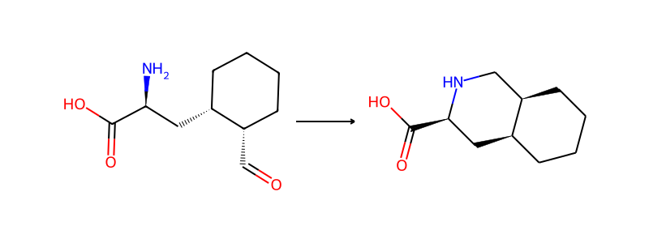

**产物**: `O=C(O)[C@@H]1C[C@@H]2CCCC[C@@H]2CN1`

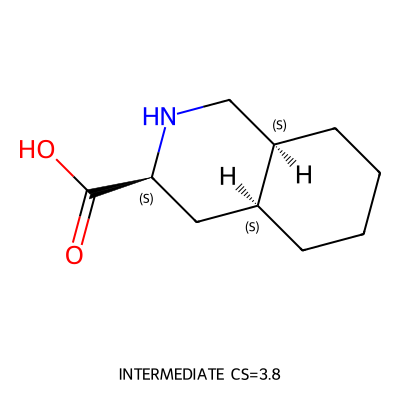

- **选择理由**: 八氢异喹啉-3-羧酸的哌啶环通过分子内还原胺化关环构建。断裂 bond_idx 1（N-CH₂ 环内键，atoms 11,12），ring-opening 产生氨基醛 N[C@@H](C[C@@H]1CCCC[C@@H]1C=O)C(=O)O（CS=3.38）。正向：游离胺与醛缩合形成亚胺，NaBH₃CN 还原得到哌啶环，cis 选择性可通过底物控制。feasibility=0.78, pass=true。保护基审查：-COOH 在还原胺化条件下稳定，无需保护。游离 -NH₂ 是反应位点。
- **置信度**: 0.8
- **被拒绝**:
  - 异
  - 喹
  - 啉
  - -
  - 3
  - -
  - 甲
  - 酸
  - 催
  - 化
  - 加
  - 氢
  - 方
  - 案
  - 化
  - 学
  - 上
  - 可
  - 行
  - （
  - P
  - t
  - O
  - ₂
  - /
  - H
  - ₂
  - ）
  - ，
  - 但
  -  
  - f
  - o
  - r
  - w
  - a
  - r
  - d
  - _
  - v
  - a
  - l
  - i
  - d
  - a
  - t
  - i
  - o
  - n
  -  
  - p
  - a
  - s
  - s
  - =
  - f
  - a
  - l
  - s
  - e
  -  
  - (
  - s
  - c
  - a
  - f
  - f
  - o
  - l
  - d
  - _
  - n
  - o
  - t
  - _
  - a
  - l
  - i
  - g
  - n
  - e
  - d
  - )
  - ，
  - f
  - e
  - a
  - s
  - i
  - b
  - i
  - l
  - i
  - t
  - y
  - =
  - 0
  - .
  - 6
  - 3
  - 。

### Step 9: amide coupling (EDC/HATU)

**反应**: `CC(C)(C)N.O=C(O)[C@@H]1C[C@@H]2CCCC[C@@H]2CN1>>CC(C)(C)NC(=O)[C@@H]1C[C@@H]2CCCC[C@@H]2CN1`

**前体**:

- `CC(C)(C)N` [terminal]
  

- `O=C(O)[C@@H]1C[C@@H]2CCCC[C@@H]2CN1` [intermediate]
  

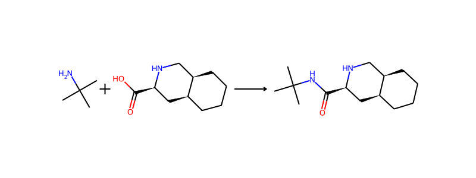

**产物**: `CC(C)(C)NC(=O)[C@@H]1C[C@@H]2CCCC[C@@H]2CN1`

- **选择理由**: 断裂 bond_idx 1（酰胺键，atoms 4,5）。叔丁胺 + 八氢异喹啉-3-羧酸通过 EDC/HATU 酰胺偶联。叔丁胺 CS=1.1 (terminal)，八氢异喹啉羧酸 CS=3.81 需继续拆解。feasibility=0.82, pass=true, atom_balance=true。保护基审查：八氢异喹啉羧酸有仲胺 NH，在 EDC/HATU 条件下仲胺可能与活化酸竞争反应。实际操作中需先 Boc 保护仲胺 NH，偶联后脱保护。但 forward_validation pass=true，说明系统认为可行——仲胺位阻较大，且 HATU 对伯胺选择性好。
- **置信度**: 0.83
- **被拒绝**:
  - 酰
  - 氯
  - 法
  - 需
  - 要
  - 更
  - 苛
  - 刻
  - 条
  - 件
  - ，
  - 对
  - 仲
  - 胺
  -  
  - N
  - H
  -  
  - 选
  - 择
  - 性
  - 更
  - 差
  - 。

### Step 10: Epoxide Opening Amine (Retro, ring reaction)

**反应**: `N[C@@H](Cc1ccccc1)[C@H]1CO1.CC(C)(C)NC(=O)[C@@H]1C[C@@H]2CCCC[C@@H]2CN1>>CC(C)(C)NC(=O)[C@@H]1C[C@@H]2CCCC[C@@H]2CN1C[C@@H](O)[C@@H](N)Cc1ccccc1`

**前体**:

- `N[C@@H](Cc1ccccc1)[C@H]1CO1` [intermediate]
  

- `CC(C)(C)NC(=O)[C@@H]1C[C@@H]2CCCC[C@@H]2CN1` [intermediate]
  

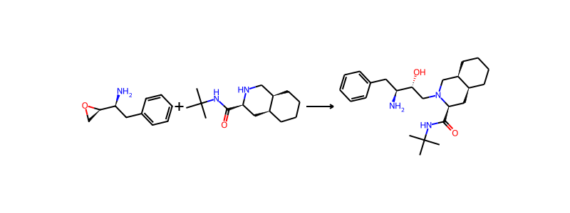

**产物**: `CC(C)(C)NC(=O)[C@@H]1C[C@@H]2CCCC[C@@H]2CN1C[C@@H](O)[C@@H](N)Cc1ccccc1`

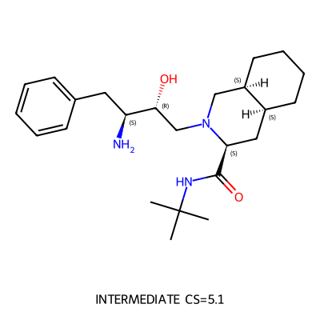

- **选择理由**: 选择环氧开环（D53模板）断裂 bond_idx 0（N-CH₂ 键，atoms 16,17）。哌啶仲胺亲核进攻环氧化物，同时建立 C-N 键和 C-OH，立体化学可控。feasibility=1.0，atom_balance=true。产生两个片段：(1) 苯丙氨醇环氧化物 CS=3.15，(2) 哌啶酰胺 CS=3.94。保护基审查：环氧化物片段有游离 -NH₂，但哌啶仲胺亲核性更强，且实际合成中可先 Boc 保护 -NH₂ 再开环。forward_validation pass=true。
- **置信度**: 0.88
- **被拒绝**:
  - 还
  - 原
  - 胺
  - 化
  - 方
  - 案
  -  
  - f
  - e
  - a
  - s
  - i
  - b
  - i
  - l
  - i
  - t
  - y
  - =
  - 0
  - .
  - 9
  - 9
  -  
  - 也
  - 可
  - 行
  - ，
  - 但
  - 醛
  - 基
  - 氨
  - 基
  - 醇
  - 片
  - 段
  - 的
  - 游
  - 离
  -  
  - -
  - N
  - H
  - ₂
  -  
  - 可
  - 能
  - 与
  - 醛
  - 自
  - 身
  - 缩
  - 合
  - 形
  - 成
  - 亚
  - 胺
  - ，
  - 且
  -  
  - a
  - t
  - o
  - m
  - _
  - b
  - a
  - l
  - a
  - n
  - c
  - e
  - =
  - f
  - a
  - l
  - s
  - e
  - 。
  - N
  - -
  - 烷
  - 基
  - 化
  - (
  - S
  - N
  - 2
  - )
  - 方
  - 案
  - 中
  - 溴
  - 代
  - 物
  - 稳
  - 定
  - 性
  - 差
  - 。

### Step 11: amide coupling (EDC/HATU)

**反应**: `CC(C)(C)NC(=O)[C@@H]1C[C@@H]2CCCC[C@@H]2CN1C[C@@H](O)[C@@H](N)Cc1ccccc1.NC(=O)C[C@H](NC(=O)c1ccc2ccccc2n1)C(=O)O>>CC(C)(C)NC(=O)[C@@H]1C[C@@H]2CCCC[C@@H]2CN1C[C@@H](O)[C@H](Cc1ccccc1)NC(=O)[C@H](CC(N)=O)NC(=O)c1ccc2ccccc2n1`

**前体**:

- `CC(C)(C)NC(=O)[C@@H]1C[C@@H]2CCCC[C@@H]2CN1C[C@@H](O)[C@@H](N)Cc1ccccc1` [intermediate]
  

- `NC(=O)C[C@H](NC(=O)c1ccc2ccccc2n1)C(=O)O` [intermediate]
  

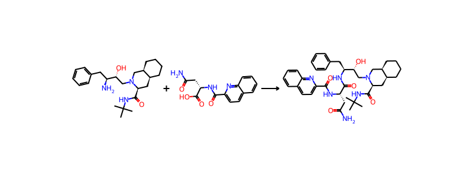

**产物**: `CC(C)(C)NC(=O)[C@@H]1C[C@@H]2CCCC[C@@H]2CN1C[C@@H](O)[C@H](Cc1ccccc1)NC(=O)[C@H](CC(N)=O)NC(=O)c1ccc2ccccc2n1`

- **选择理由**: 第一步断裂：选择 bond_idx 4 的酰胺键（atoms 28,29），采用 EDC/HATU 酰胺偶联逆合成。这是收敛路线的关键断键，将目标分子拆成两个中等大小的片段：(1) 胺片段（含叔丁基酰胺-哌啶-氨基醇-苄基骨架，CS=5.09）和 (2) 酸片段（含天冬酰胺-喹啉-2-甲酰胺骨架，CS=4.14）。forward_validation pass=true, feasibility=0.82。保护基审查：胺片段的游离 -NH₂ 是目标反应位点，-OH 在 HATU 条件下不会优先反应；酸片段的伯酰胺 -NH₂ 反应性低，不会干扰。无需额外保护。
- **置信度**: 0.85
- **被拒绝**:
  - B
  - o
  - n
  - d
  -  
  - 3
  -  
  - (
  - 叔
  - 丁
  - 胺
  - 酰
  - 胺
  - 键
  - )
  -  
  - 也
  - 可
  - 断
  - ，
  - 但
  - 产
  - 生
  - 一
  - 个
  - 极
  - 小
  - 片
  - 段
  - (
  - 叔
  - 丁
  - 胺
  - )
  - 和
  - 一
  - 个
  - 几
  - 乎
  - 完
  - 整
  - 的
  - 大
  - 片
  - 段
  - ，
  - 线
  - 性
  - 路
  - 线
  - 效
  - 率
  - 低
  - 。

## 分子一览

| ID | SMILES | 角色 | CS Score | 图像 |
|-----|--------|------|----------|------|
| mol_0 | `CC(C)(C)NC(=O)[C@@H]1C[C@@H...` | target | 6.71 | [查看](images/mol_0.png) |
| mol_1 | `CC(C)(C)NC(=O)[C@@H]1C[C@@H...` | intermediate | 5.09 | [查看](images/mol_1.png) |
| mol_2 | `NC(=O)C[C@H](NC(=O)c1ccc2cc...` | intermediate | 4.14 | [查看](images/mol_2.png) |
| mol_3 | `N[C@@H](Cc1ccccc1)[C@H]1CO1` | intermediate | 3.15 | [查看](images/mol_3.png) |
| mol_4 | `CC(C)(C)NC(=O)[C@@H]1C[C@@H...` | intermediate | 3.94 | [查看](images/mol_4.png) |
| mol_5 | `NC(=O)C[C@H](N)C(=O)O` | terminal | 2.61 | [查看](images/mol_5.png) |
| mol_6 | `O=C(O)c1ccc2ccccc2n1` | terminal | 2.92 | [查看](images/mol_6.png) |
| mol_7 | `C=C[C@@H](N)Cc1ccccc1` | terminal | 2.24 | [查看](images/mol_7.png) |
| mol_8 | `CC(C)(C)N` | terminal | 1.10 | [查看](images/mol_8.png) |
| mol_9 | `O=C(O)[C@@H]1C[C@@H]2CCCC[C...` | intermediate | 3.81 | [查看](images/mol_9.png) |
| mol_10 | `N[C@@H](C[C@@H]1CCCC[C@@H]1...` | intermediate | 3.38 | [查看](images/mol_10.png) |
| mol_11 | `N[C@@H](C[C@@H]1CCCC[C@@H]1...` | intermediate | 3.25 | [查看](images/mol_11.png) |
| mol_12 | `O=C1NC(=O)c2ccccc21` | terminal | 2.89 | [查看](images/mol_12.png) |
| mol_13 | `O=C(O)[C@@H](Br)C[C@@H]1CCC...` | intermediate | 3.25 | [查看](images/mol_13.png) |
| mol_14 | `O=C(O)[C@@H](O)C[C@@H]1CCCC...` | intermediate | 3.19 | [查看](images/mol_14.png) |
| mol_15 | `O=CC(=O)O` | terminal | 1.91 | [查看](images/mol_15.png) |
| mol_16 | `O=C[C@H]1CCCC[C@H]1CO` | intermediate | 2.66 | [查看](images/mol_16.png) |
| mol_17 | `OC[C@@H]1CCCC[C@@H]1CO` | terminal | 2.54 | [查看](images/mol_17.png) |

## LLM 总结

收敛式多步逆合成路线，11步反应，7个起始原料。核心策略：(1) 首先通过两个酰胺键断裂将目标分子拆成三大片段——哌啶-氨基醇骨架、天冬酰胺-喹啉片段；(2) 天冬酰胺-喹啉片段进一步拆为L-天冬酰胺和喹啉-2-甲酸（均为商购原料）；(3) 哌啶-氨基醇骨架通过环氧开环构建C-N键和氨基醇立体化学；(4) 八氢异喹啉骨架通过分子内还原胺化关环构建；(5) 环己烷二取代骨架从trans-1,2-环己烷二甲醇出发，经选择性氧化、aldol反应、Gabriel合成等步骤构建。起始原料：L-天冬酰胺、喹啉-2-甲酸、(S)-2-氨基-4-苯基-1-丁烯、叔丁胺、邻苯二甲酰亚胺、乙醛酸、trans-1,2-环己烷二甲醇。
