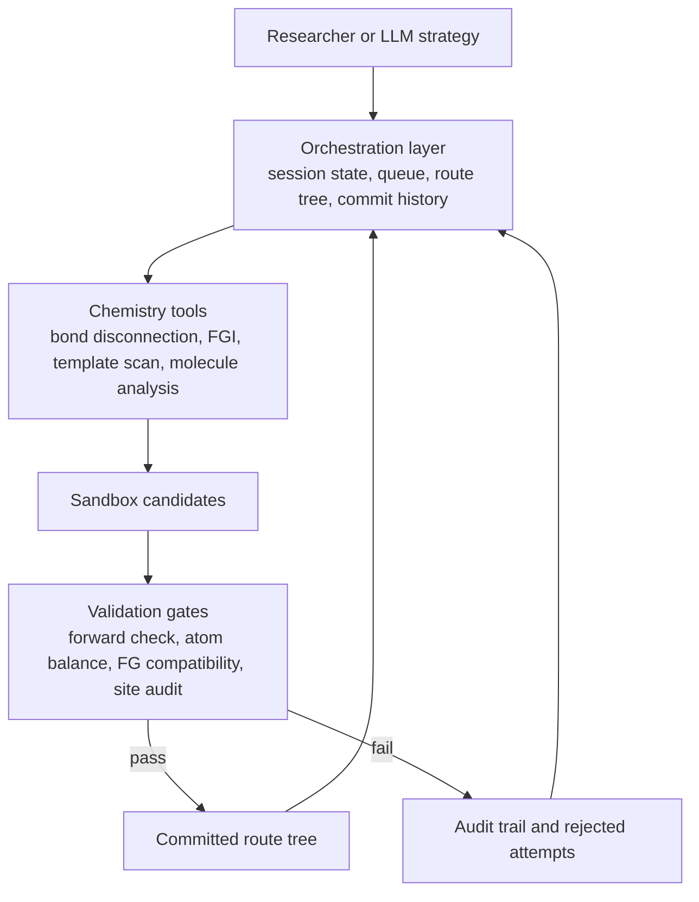
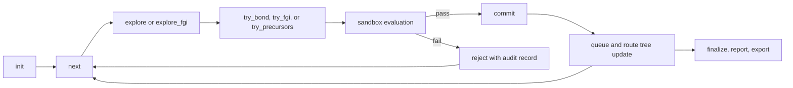
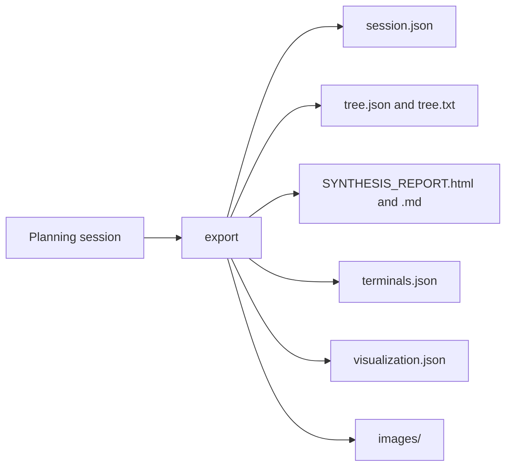

<div align="right">

[English](./README.md) | [简体中文](./README.zh-CN.md)

</div>

<div align="center">

<a id="top"></a>

# Rachel

**Formalized chemical reasoning for multi-step retrosynthesis**


<p>
  <a href="#trace-demo">Trace Demo</a> |
  <a href="#why-rachel">Why Rachel</a> |
  <a href="#system-view">System View</a> |
  <a href="#selected-molecules">Selected Molecules</a> |
  <a href="#minimal-quickstart">Quickstart</a>
</p>

https://github.com/user-attachments/assets/4dc9990f-00b2-40d8-a8c3-181c6f0c568b

</div>

Multi-step retrosynthesis is not only about proposing a locally plausible disconnection. It also requires preserving scaffold consistency, functional-group compatibility, route convergence, and precursor executability across multiple dependent steps. Rachel is built around that stricter formulation.

Rather than treating retrosynthesis as a one-shot text generation problem, Rachel formalizes route construction as a persistent `state -> action -> validation -> commit` process. Candidate steps are explored in a sandbox, checked by chemistry-grounded validators, and only then written into the main route tree. The result is a planning workflow that is easier to inspect, recover, compare, and analyze at route level.

At a glance, Rachel combines:

- persistent session state instead of isolated route guesses
- chemistry-grounded operators such as bond disconnection and FGI
- sandboxed local trials before route-tree commitment
- validation gates including forward checks, atom balance, and site-aware auditing
- explicit route memory, audit traces, and exportable planning artifacts
- LLM guidance as a strategy layer rather than an unchecked chemistry oracle

## Trace Demo

The trace above is the fastest visual entry point into Rachel. It shows how the system moves from structured context to sandboxed candidates, validator-gated selection, and committed route growth.


- The emphasis is on planning behavior, not only final route output
- Rejected attempts remain part of the story instead of disappearing into free-form text
- The figure is useful for understanding what Rachel is doing between target input and final route export

## End-to-End Example

The figure below compares a PaRoutes ground-truth plan with Rachel's generated result on case `n1_366`.


This is included as a route-level qualitative reference, not merely a single-step plausibility check. The relevant question is whether the route remains interpretable and structurally coherent as a whole.

<a id="why-rachel"></a>
## Why Rachel

Many retrosynthesis systems can output route-like text. Rachel is organized around a different question: how should a route be **constructed** when intermediate decisions must remain visible, reviewable, and recoverable?

That framing changes the role of the model and the role of the system:

- the model helps compare, rank, and explain candidate actions
- the chemistry layer generates operators and enforces validation gates
- the orchestration layer preserves state, route-tree structure, and decision history

Rachel therefore shifts the task from "generate a route" to "organize a traceable decision process for building one."

## Highlights

| Capability | What it means in Rachel |
| --- | --- |
| Stateful planning | Rachel reasons over persistent session state instead of isolated one-shot answers. |
| Grounded operator space | Bond disconnection and FGI are treated as complementary planning operators. |
| Sandbox before commitment | Candidate steps are tried locally before they affect the main route tree. |
| Validation-gated execution | Forward feasibility, atom balance, and related validators help control commitment. |
| Site-aware auditing | Local position consistency checks help catch deceptively plausible but misaligned precursors. |
| Structured route memory | Accepted steps become explicit route-tree objects rather than only free-form text. |
| Audit-aware planning | Failed attempts and local checks remain available as planning evidence instead of being discarded. |
| LLM as strategy layer | The LLM helps organize search and choice, rather than acting as an unchecked chemistry oracle. |

<a id="system-view"></a>
## System View

Rachel follows a layered design derived from the paper-facing project framing: orchestration manages the planning session, chemistry tools generate and validate candidates, and the LLM operates at the strategy layer over compressed structured context.



This separation matters. It keeps chemistry-grounded checks out of free-form model text, while still letting the model contribute to search organization and candidate comparison.

## Orchestration View

The repository is not only a collection of reaction operators. It also exposes an explicit planning protocol that makes state transitions inspectable.



This is the main reason Rachel reads more like a planning system than a one-shot generator. Candidate actions are tested before they change the route tree, and failures remain attached to the session instead of being silently overwritten.

## Validation Stack

The paper-intro framing becomes more concrete if the validators are made explicit:

| Validation layer | Purpose |
| --- | --- |
| Forward executability | Checks whether a proposed step remains plausible under forward-style evaluation. |
| Atom and scaffold consistency | Prevents bookkeeping errors and route drift that look plausible in text but fail structurally. |
| Functional-group compatibility | Flags local chemistry conflicts before commitment. |
| Site-aware auditing | Helps detect same-scaffold precursors that modify the wrong position. |
| Route-state constraints | Ensures accepted steps remain consistent with the live session and route-tree state. |

## Core Workflow


This is the compact view of the Rachel loop. The key difference from route-text generation is that validated actions become durable route objects, while rejected actions remain informative planning artifacts.

## Selected Molecules

Rachel is currently showcased with three qualitative examples chosen to cover complementary strengths.

<table>
  <tr>
    <td align="center" width="33%">
      <br>
      <strong>QNTR</strong>
    </td>
    <td align="center" width="33%">
      <br>
      <strong>Losartan</strong>
    </td>
    <td align="center" width="33%">
      <br>
      <strong>Rivaroxaban</strong>
    </td>
  </tr>
</table>

| Molecule | Role | Route depth | What it highlights |
| --- | --- | ---: | --- |
| `QNTR` | Experimentally grounded example | 6 steps | A route tied to real synthesis experience, useful for comparing planning behavior against laboratory practice |
| `Losartan` | Canonical medicinal chemistry target | 4 steps | Convergent route logic with recognizable medicinal chemistry disconnections |
| `Rivaroxaban` | Deeper drug-like example | 5 steps | Longer-horizon planning with a broader transformation mix |

### QNTR

QNTR is the most experimentally grounded case in the current README. It is connected to a completed synthesis campaign rather than being only a benchmark-style target, which makes it a useful reference for judging whether Rachel is recovering route strategy rather than merely satisfying local templates.

In this case, the real synthesis and Rachel's current route converge on a similar three-part decomposition with overlapping terminal building blocks, related intermediates, and closely aligned reaction logic. Earlier Rachel versions were notably weaker on FGI handling and on ring opening or closure behavior. That gap was one of the main reasons for pushing the system toward a more chemistry-feasible planning framework.

#### Experimental Route


#### Early Rachel Route


#### Current Rachel Route


- 6-step route from 4 starting materials
- Useful as a route-level comparison between experimental chemistry and model-guided planning
- Valuable because the accepted route reflects decomposition strategy, not only local template satisfaction
- Also useful historically, because it shows what Rachel used to get wrong and what the current workflow is designed to correct

### Losartan

A canonical medicinal chemistry target with a recognizable convergent route.

- 4-step route from 4 starting materials
- Highlights tetrazole formation, N-alkylation, and Suzuki coupling logic
- Useful as a benchmark-like example that many readers can immediately interpret

### Rivaroxaban

A deeper drug-like example with a richer transformation mix.

- 5-step route from 4 starting materials
- Highlights Buchwald-Hartwig amination, FGI, cyclization, and amide formation
- Useful for showing that Rachel is not limited to short or purely toy routes

### Dual Drug-Case Comparison

The figure below places the Losartan and Rivaroxaban examples into one annotated comparison view.


- `Losartan` emphasizes classical convergent medicinal chemistry logic
- `Rivaroxaban` emphasizes deeper route depth and operator diversity
- The pair helps readers compare route style, not just isolated outcomes

## Minimal Quickstart

Current local runs assume a Python environment with the main research dependencies already available, including Python 3.10+, RDKit, `numpy`, and `Pillow`.

```python
from Rachel.main import RetroCmd

cmd = RetroCmd("my_session.json")

cmd.execute(
    "init",
    {
        "target": "CC(=O)Nc1ccc(O)cc1",
        "name": "Paracetamol",
        "terminal_cs_threshold": 1.5,
    },
)

ctx = cmd.execute("next")

cmd.execute(
    "try_precursors",
    {
        "precursors": ["CC(=O)Cl", "Nc1ccc(O)cc1"],
        "reaction_type": "Schotten-Baumann acylation",
    },
)

cmd.execute(
    "commit",
    {
        "idx": 0,
        "reasoning": "Acylation with simple, accessible precursors.",
        "confidence": "high",
    },
)
```

This is a protocol-level example, not a full benchmark workflow. More technical notes are preserved in [usage notes](docs/usage-notes.md).

## Typical Outputs

A completed run can export route-level artifacts rather than only a final answer string.



Typical outputs include:

- `SYNTHESIS_REPORT.html` and `SYNTHESIS_REPORT.md`
- `report.txt` for a forward-style textual summary
- `tree.json` and `tree.txt` for route-tree inspection
- `terminals.json` for starting-material lists
- `visualization.json` for downstream rendering
- `session.json` for full planning-state recovery
- molecule, reaction, and route overview images under `images/`

<details>
<summary><strong>Repository Map</strong></summary>

- [main](main): orchestration, session logic, route tree, reports, and command interface
- [chem_tools](chem_tools): chemistry-grounded operators and validation utilities
- [tools](tools): helper scripts for runs, analysis, visualization, and related research workflows
- [docs](docs): usage notes, showcase material, and paper-facing documentation
- [plan](plan): manuscript drafts, writing materials, and paper-preparation assets
- [tests](tests): current validation and experiment-support material
- [data](data): datasets, intermediate artifacts, and experiment-side resources
- [assets](assets): project figures and supporting visual materials

</details>

## Project Status

- Active research codebase
- Currently being cleaned up for arXiv-facing presentation
- Core workflow is already in use
- Documentation is improving, but the repository remains a live research workspace
- Not yet a fully hardened OSS release
