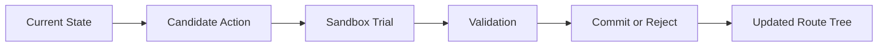

# Rachel

**Rachel** is a formalized chemical reasoning framework for multi-step retrosynthesis.

It treats retrosynthetic planning as a structured `state -> action -> validation -> commit` process rather than a one-shot text generation task. The current repository is an active research codebase being cleaned up for arXiv-facing presentation while remaining in day-to-day use.

## Trace Demo

A visual walkthrough of the Rachel planning workflow from structured state to a committed retrosynthetic route.

[](assets/media/rachel-trace.mp4)

If GitHub does not preview the video inline in your browser, open the [MP4 trace](assets/media/rachel-trace.mp4) directly.

## What Rachel Is

Rachel combines:

- a session-driven planning workflow
- chemistry-grounded operators such as bond disconnection and FGI
- sandboxed local trials before route commitment
- validator-gated route construction
- route-tree memory and audit state

The goal is not just to propose a route, but to make route construction inspectable, recoverable, and chemically checkable.

## End-to-End Example

The figure below shows a full end-to-end comparison between a PaRoutes ground-truth route and Rachel's generated result on case `n1_366`. It is included here as a qualitative systems-level example: not just a local disconnection, but a complete route comparison between reference and generated planning behavior.


This example is useful because it makes the intended reading mode of Rachel explicit. The point is not only whether a single step looks plausible, but whether the system can assemble a route that remains interpretable at the full planning level. It also gives the README one concrete end-to-end reference point before readers move into the individual showcase molecules below.

## Why Rachel Is Different

- Rachel is stateful: it plans through persistent session state rather than isolated answers.
- Rachel uses bond disconnection and FGI as complementary operators instead of forcing everything into one move type.
- Rachel separates local exploration from route commitment through sandbox trials.
- Rachel treats validation as part of the planning loop rather than as a purely downstream score.
- Rachel stores route structure and decision traces as explicit objects.
- Rachel uses the LLM as a strategy layer rather than as a free-form chemistry oracle.

## Core Workflow



Candidate actions are explored before they are written into the route. Validated steps move forward into the main tree; rejected attempts remain informative planning artifacts rather than disappearing into free-form text.

## Selected Molecules

Rachel is currently showcased with three qualitative examples chosen to cover complementary strengths:

| Molecule | Role | Route depth | What it highlights |
| --- | --- | ---: | --- |
| `QNTR` | Experimentally grounded example | 2 steps | A short, interpretable route tied to real synthesis experience |
| `Losartan` | Canonical medicinal chemistry target | 4 steps | Convergent route logic with recognizable medicinal chemistry disconnections |
| `Rivaroxaban` | Deeper drug-like example | 5 steps | Longer-horizon planning with a broader transformation mix |

**QNTR**  
An experimentally grounded molecule connected to your own synthesis experience.


**Losartan**  
A classic medicinal chemistry target with a recognizable convergent route.


**Rivaroxaban**  
A deeper drug-like route with diverse transformations.


See the full qualitative page in [showcases](docs/showcases.md).

## Minimal Quickstart

Current local runs assume a Python environment with the main research dependencies already available, including Python 3.10+, RDKit, `numpy`, and `Pillow`.

```python
from Rachel.main import RetroCmd

cmd = RetroCmd("my_session.json")

cmd.execute(
    "init",
    {
        "target": "CC(=O)Nc1ccc(O)cc1",
        "name": "Paracetamol",
        "terminal_cs_threshold": 1.5,
    },
)

ctx = cmd.execute("next")

cmd.execute(
    "try_precursors",
    {
        "precursors": ["CC(=O)Cl", "Nc1ccc(O)cc1"],
        "reaction_type": "Schotten-Baumann acylation",
    },
)

cmd.execute(
    "commit",
    {
        "idx": 0,
        "reasoning": "Acylation with simple, accessible precursors.",
        "confidence": "high",
    },
)
```

This is a protocol-level example, not a full benchmark workflow. More technical notes are preserved in [usage notes](docs/usage-notes.md).

## Repository Map

- [main](main): orchestration, session logic, route tree, reports, and command interface
- [chem_tools](chem_tools): chemistry-grounded operators and validation utilities
- [tools](tools): helper scripts for runs, analysis, visualization, and related research workflows
- [tests](tests): current validation and experiment-support material
- [plan](plan): manuscript drafts, writing materials, and paper-preparation assets

## Project Status

- Active research codebase
- Currently being prepared for arXiv-facing presentation
- Documentation is being cleaned up, but the repository remains under active use
- Core workflow is already in use
- Not yet a fully hardened OSS release
