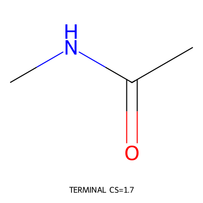
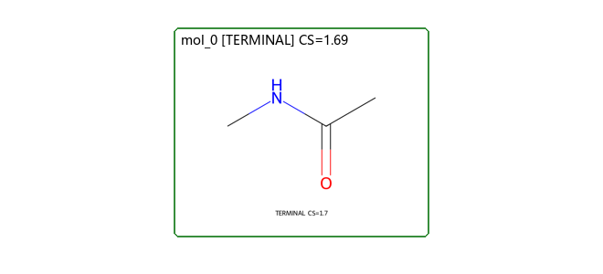

# release_smoke_acetamide - Forward Synthesis Planning Report

**Target SMILES**: `CNC(C)=O`

**Route scale**: 0 steps; 1 planned starting materials

## Route Conclusion

- **Route thesis**: Use a direct amide disconnection smoke strategy.
- **Route mode**: late_fgi
- **Route summary**: Offline post-route audit smoke.
- **Experimental outcomes**: none; planning commits do not imply experimental success
- **Post-route audit summary**: status=incomplete; buyability B0/B1/B2=1/0/0; safety S1 substances=0; process-ready/incomplete steps=0/0; incomplete because: substance_safety_lookup_incomplete, offline_mode
- **Full audit**: [Markdown](post_route_audit.md) | [JSON](post_route_audit.json)

## Route Overview

## Planned Starting Materials (1)

| Structure | SMILES |
|---|---|
|  | `CNC(C)=O` |

- **Terminal basis for `mol_0`**: Accepted as a planned starting material. Reason: Small stable material used only for release audit smoke.

## Forward Synthesis Steps (0)

## Raw Data

Complete planning and audit records are retained in [`session.json`](session.json) and [`tree.json`](tree.json).
