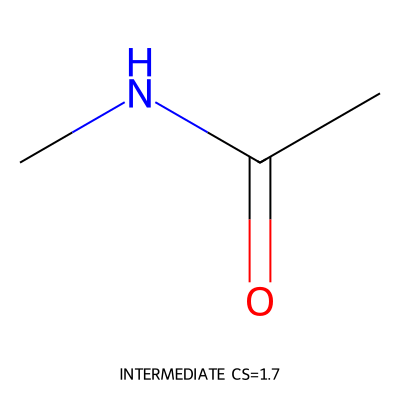
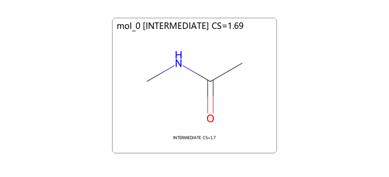

# release_smoke_stale - Forward Synthesis Planning Report

**Target SMILES**: `CNC(C)=O`

**Route scale**: 0 steps; 0 planned starting materials

## Route Conclusion

- **Route thesis**: Use a direct amide disconnection smoke strategy.
- **Route mode**: late_fgi
- **Route review context**:
  - **Terminal reopened for further planning**: CNC(C)=O. Reason: Reopen only to verify route-digest staleness.
- **Experimental outcomes**: none; planning commits do not imply experimental success
- **Post-route audit summary**: No post-finalize audit has been run for the current route

## Route Overview

## Planned Starting Materials (0)

| Structure | SMILES |
|---|---|

## Forward Synthesis Steps (0)

## Raw Data

Complete planning and audit records are retained in [`session.json`](session.json) and [`tree.json`](tree.json).
